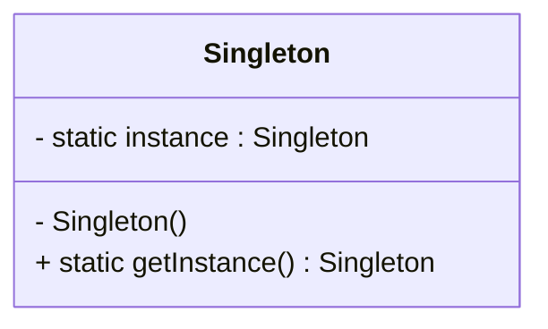

# Article 1-1-1 : Origine des design patterns avec le Gang of Four

## Introduction

Les *design patterns*, ou patrons de conception, sont des solutions éprouvées à des problèmes récurrents dans le développement logiciel orienté objet. Leur origine remonte au monde de l’architecture avant d’être adaptées et popularisées dans le domaine du génie logiciel par un groupe d’experts appelé le **Gang of Four** (GoF), avec la publication en 1994 de leur ouvrage fondateur.

---

## Contexte historique

Le concept de design patterns a initialement émergé des travaux de l’architecte Christopher Alexander, qui, dans les années 1970, a proposé des “motifs” ou modèles réutilisables pour résoudre des problèmes dans l’architecture de bâtiment. Inspirés par cette idée, quatre informaticiens — Erich Gamma, Richard Helm, Ralph Johnson et John Vlissides — ont adapté ce concept aux logiciels orientés objets. Ils ont formalisé 23 patrons dans leur livre : 

**Design Patterns: Elements of Reusable Object-Oriented Software** (1994).

Ce livre est rapidement devenu une référence incontournable, posant les bases de la conception logicielle modulaire avec des solutions éprouvées que tout développeur peut appliquer.

---

## Pourquoi les Design Patterns du Gang of Four ?

Avant ces patrons, chaque développeur ou équipe devait inventer des solutions aux mêmes problèmes, ce qui conduisait à du code redondant et peu maintenable. Le GoF a rassemblé ces solutions pour :

- **Partager un vocabulaire commun** : parler des mêmes patrons avec les mêmes termes facilite la communication.
- **Favoriser la réutilisation** : appliquer des solutions éprouvées évite de réinventer la roue.
- **Améliorer la maintenabilité** : un design basé sur des patrons est souvent plus clair et extensible.

---

## Les 23 patrons de conception

Ces patrons sont divisés en trois catégories :

| Catégorie       | Description                                        | Exemples courants                  |
|-----------------|--------------------------------------------------|----------------------------------|
| Créationnels    | Gèrent la création d’objets                        | Singleton, Factory Method, Builder|
| Structurels     | Concernent la composition des classes/objets      | Adapter, Composite, Decorator    |
| Comportementaux | Gèrent la communication entre objets               | Observer, Strategy, Command      |

---

## Exemple illustratif : le pattern Singleton

Le pattern Singleton assure qu’une classe n’a qu’une seule instance et fournit un point d’accès global à cette instance.

```java
public class Singleton {
    private static Singleton instance;

    private Singleton() { }

    public static Singleton getInstance() {
        if (instance == null) {
            instance = new Singleton();
        }
        return instance;
    }
}
```

### Diagramme Mermaid du Singleton



---

## Impact et actualité

Vingt ans après sa publication, le livre du Gang of Four continue d’être une bible pour les développeurs. Les patrons qu’il décrit restent la base pour comprendre la conception orientée objet, même si des langages modernes ou paradigmes (comme la programmation fonctionnelle) proposent des alternatives ou évolutions.

Les frameworks actuels (Java Spring, .NET, etc.) intègrent souvent ces patron et on en retrouve leurs traces dans de nombreuses architectures logicielles.

---

## Sources utilisées

- DigitalOcean, "Gang of 4 Design Patterns Explained", https://www.digitalocean.com/community/tutorials/gangs-of-four-gof-design-patterns  
- SE Radio, "Gang of Four – 20 Years Later", https://se-radio.net/2014/11/episode-215-gang-of-four-20-years-later/  
- Developpez.com, "Design Patterns du Gang of Four appliqués à Java", https://rpouiller.developpez.com/tutoriel/java/design-patterns-gang-of-four?page=introduction

---

Cet article montre comment la formalisation des design patterns par le Gang of Four a structuré et optimisé la conception logicielle, proposant des outils conceptuels indispensables qui perdurent encore aujourd’hui.