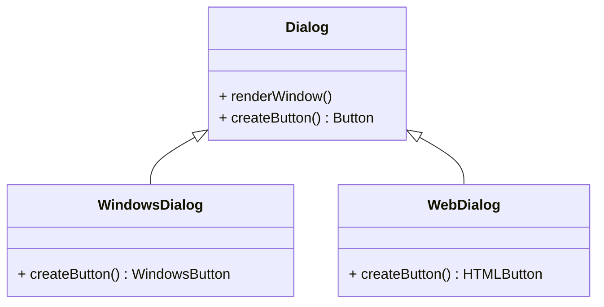

# Article 1-1-2 : Émergence des design patterns en génie logiciel

## Introduction

Les design patterns sont devenus un élément central dans la conception logicielle moderne. Leur émergence en génie logiciel répond à un besoin de capitaliser sur des solutions récurrentes face à des problèmes de conception complexes, favorisant la réutilisation et la robustesse des architectures. Cet article retrace leur évolution spécifique dans le domaine du logiciel, en s’appuyant sur les étapes clés et exemples illustratifs.

---

## Genèse des design patterns en génie logiciel

### Origines conceptuelles externes

Le concept de design pattern a d'abord trouvé son origine dans l’architecture, avec Christopher Alexander qui, dans les années 1970, a théorisé des "patrons" pour résoudre des problèmes de conception dans la construction et l’aménagement urbain. Ces patrons visent à créer un langage commun pour décrire et appliquer des solutions réussies.

Ce concept a été adapté et transposé au génie logiciel face à la complexité croissante des systèmes orientés objet des années 80 et 90. Les développeurs essayaient de systématiser les bonnes pratiques pour éviter la réinvention perpétuelle de solutions.

### Contexte logiciel

Dans les années 1980, avec la montée en puissance de la programmation orientée objet (POO), le génie logiciel rencontrait de nouveaux défis : modularité, évolutivité, communication inter-objets. La discipline manquait alors d'un cadre formalisé garantissant des designs efficaces.

C’est dans ce cadre que les design patterns ont émergé comme une réponse pragmatique. Ils formalisent des solutions éprouvées, décrites sous forme de modèles réutilisables pour répondre à des problèmes typiques d’architecture et de conception objet.

---

## Formalisation par le Gang of Four

L’étape décisive a été la publication en 1994 du livre :

*Design Patterns: Elements of Reusable Object-Oriented Software* par Erich Gamma, Richard Helm, Ralph Johnson et John Vlissides, dits le **Gang of Four** (GoF).

Ce livre a systématisé 23 patrons classés en trois familles (créationnels, structurels, comportementaux), permettant aux développeurs de disposer d’un langage commun et d’une boîte à outils conceptuelle robuste.

---

## Exemples d’émergence dans un contexte logiciel

### Exemple : Factory Method (Créationnel)

Le problème : comment créer des objets sans connaître leur classe concrète à l’avance ?

La solution Factory Method propose de déléguer la création à une sous-classe via une méthode "fabrique".

```java
abstract class Dialog {
    public void renderWindow() {
        Button okButton = createButton();
        okButton.render();
    }

    // Méthode de création abstraite
    public abstract Button createButton();
}

class WindowsDialog extends Dialog {
    public Button createButton() {
        return new WindowsButton();
    }
}

class WebDialog extends Dialog {
    public Button createButton() {
        return new HTMLButton();
    }
}
```

### Diagramme Mermaid illustrant Factory Method



---

## Bénéfices de l’émergence des design patterns

- **Réutilisabilité** : capitalisation sur des solutions éprouvées.
- **Communicabilité** : vocabulaire unifié améliorant la collaboration.
- **Robustesse et maintenance** : architectures plus claires, évolutives et testables.
- **Standardisation** : modes de conception répandus facilitant la montée en compétence.

---

## Sources utilisées

- [Les Design Patterns - Le LIP6](https://www.lip6.fr/Reda.Bendraou/wp-content/uploads/sites/10/2023/01/cours3_gererlaqualite_design_patterns.pdf)  
- Rheinwerk Computing, "What Are Design Patterns? History, Origins, and Software Development Impact", https://blog.rheinwerk-computing.com/design-patterns-history-origins-and-impact  
- Génie Logiciel - GitBook, "Patrons logiciels", https://ensc.gitbook.io/genie-logiciel/04-patrons-logiciels  
- Wikipédia, "Patron de conception", https://fr.wikipedia.org/wiki/Patron_de_conception  

---

Cet article montre comment les design patterns ont émergé dans le génie logiciel comme une nécessité de standardiser la conception objet, apportant un cadre conceptuel essentiel à la création de systèmes logiciels maintenables et évolutifs.