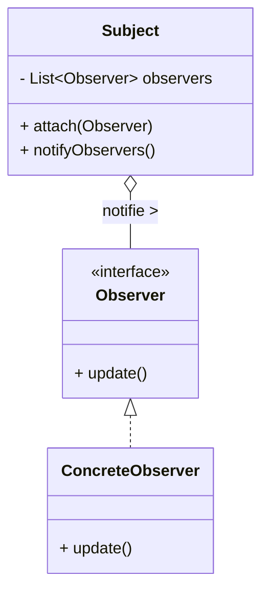

# Article 1-1-3 : Importance des patterns pour la réutilisabilité et la maintenance

## Introduction

Les design patterns jouent un rôle central dans la qualité et la pérennité des logiciels. Leur utilisation impacte directement deux aspects cruciaux : la réutilisabilité du code et sa maintenance. Cet article expose pourquoi les patrons de conception facilitent la création de systèmes modulaires, évolutifs et fiables.

---

## Réutilisabilité : capitaliser sur des solutions éprouvées

### Problématique

Dans le développement logiciel, la réutilisation évite la duplication du code et de l’effort de conception. Mais créer du code réutilisable nécessite des structures génériques, flexibles, et bien définies.

### Apport des design patterns

Les design patterns incarnent des solutions éprouvées à des problèmes récurrents et génériques, rangées dans des modèles conceptuels faciles à adapter.

- **Modularité** : Par exemple, le pattern **Strategy** permet de changer dynamiquement le comportement d’un objet sans le modifier.
- **Decouplage** : Les patterns tels que **Observer** ou **Mediator** facilitent la communication entre objets indépendants.
- **Généricité** : Un patron comme **Factory Method** centralise la création d’objets, rendant l’extension du système plus simple.

Ces modèles servent de patrons architecturaux qu’on réutilise efficacement dans différentes applications, réduisant ainsi le temps de développement.

---

## Maintenance : faciliter les évolutions et corrections

### Défi

Les logiciels évoluent constamment, ce qui rend la maintenance fréquente et souvent complexe. Un design rigide, peu clair ou trop couplé complique les modifications.

### Contribution des design patterns

Les design patterns permettent d’anticiper le changement :

- **Ouvert à l’extension, fermé à la modification** (principe OCP) : les patterns encouragent à étendre les fonctionnalités sans modifier le code existant.
- **Isolation des responsabilités** : Par exemple, **Decorator** permet d’ajouter des fonctionnalités à un objet sans toucher à son code source.
- **Réduction du couplage** : En fragmentant les interactions, ils rendent le code plus facile à comprendre et modifier localement.

---

## Exemple pratique : le pattern Observer

Le pattern Observer définit une relation de dépendance 1-n entre objets, où un changement dans un objet (le sujet) notifie automatiquement ses observateurs.

### Avantages pour la maintenance et la réutilisation

- Le système est découplé : le sujet ne connaît pas les détails des observateurs.
- On peut ajouter/supprimer des observateurs facilement sans modifier le sujet.
- Le modèle est réutilisable dans divers contextes (interfaces graphiques, systèmes d’événements, etc.).

```java
interface Observer {
    void update();
}

class Subject {
    private List<Observer> observers = new ArrayList<>();

    public void attach(Observer o) {
        observers.add(o);
    }

    public void notifyObservers() {
        for (Observer o : observers) {
            o.update();
        }
    }
}
```

### Diagramme Mermaid illustrant Observer



---

## Synthèse

| Aspect           | Impact des Design Patterns                           |
|------------------|-----------------------------------------------------|
| Réutilisabilité  | Solutions génériques, modularité, déconnexion       |
| Maintenance      | Extensibilité sans modification, responsabilités isolées, faible couplage |

---

## Sources utilisées

- Oracle, "Design Patterns and Principles", https://docs.oracle.com/javase/tutorial/java/concepts/designpatterns.html  
- Refactoring Guru, "Observer Design Pattern", https://refactoring.guru/design-patterns/observer  
- IBM Developer, "Why are design patterns important?", https://developer.ibm.com/articles/design-patterns-in-software-engineering/  
- Wikipedia, "Design pattern (computer science)", https://en.wikipedia.org/wiki/Design_pattern_(computer_science)  

---

Les design patterns sont donc plus que des modèles : ils sont un levier essentiel pour construire des logiciels flexibles et durables, permettant de maîtriser la complexité tout en favorisant la réutilisation et la maintenance aisée du code.