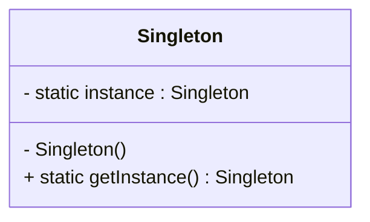
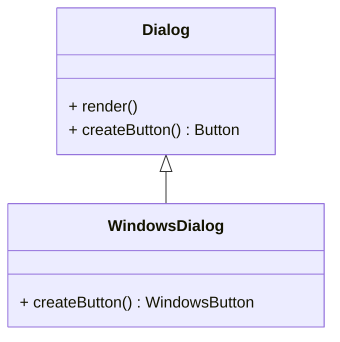

# Article 1-2-1 : Patterns de création : gestion de l'instanciation des objets

## Introduction

La création d’objets est une étape fondamentale dans les applications orientées objet. Cependant, le simple appel direct de constructeurs peut rendre le code rigide, difficile à maintenir ou à étendre. Les **patterns de création** répondent précisément à ce problème : ils fournissent des mécanismes abstraits et flexibles pour gérer l’instanciation, tout en cachant la complexité de la création.

---

## Qu’est-ce qu’un pattern de création ?

Un pattern de création est un patron de conception qui s’attache à la reconnaissance des objets à créer, la manière de les instancier et les étapes pour leur construction.

Ils facilitent :

- L’isolation de la logique de création,
- La gestion d’objets complexes,
- La flexibilité dans le choix de la classe concrète instanciée.

---

## Principaux patterns de création

### 1. Singleton

Assure qu’une classe ait une seule et unique instance accessible globalement.

**Exemple simplifié en Java :**

```java
public class Singleton {
    private static Singleton instance;
    private Singleton() {}

    public static Singleton getInstance() {
        if (instance == null) {
            instance = new Singleton();
        }
        return instance;
    }
}
```

### Diagramme Mermaid Singleton



---

### 2. Factory Method

Délègue la création d'objet à des sous-classes via une méthode d'instanciation abstraite, permettant de varier les types instanciés sans modifier le code client.

**Exemple simplifié :**

```java
abstract class Dialog {
    public void render() {
        Button button = createButton();
        button.render();
    }
    abstract Button createButton();
}

class WindowsDialog extends Dialog {
    Button createButton() {
        return new WindowsButton();
    }
}
```

### Diagramme Mermaid Factory Method



---

### 3. Abstract Factory

Fournit une interface pour créer des familles d’objets liés sans spécifier leurs classes concrètes.

**Exemple synthétique :**

```java
interface GUIFactory {
    Button createButton();
    Checkbox createCheckbox();
}

class WinFactory implements GUIFactory {
    public Button createButton() { return new WinButton(); }
    public Checkbox createCheckbox() { return new WinCheckbox(); }
}
```

---

### 4. Builder

Sépare la construction d’un objet complexe de sa représentation, permettant d'assembler des objets pas à pas.

**Exemple simplifié :**

```java
class CarBuilder {
    private Car car = new Car();
    public CarBuilder buildWheels(int count) { car.setWheels(count); return this; }
    public CarBuilder buildEngine(Engine e) { car.setEngine(e); return this; }
    public Car getResult() { return car; }
}
```

---

### 5. Prototype

Permet de créer de nouveaux objets en clonant un objet prototype existant, particulièrement utile quand la création est coûteuse.

---

## Synthèse des patterns créatifs

| Pattern          | Usage principal                                        |
| -----------------|--------------------------------------------------------|
| Singleton        | Instance unique globale                                |
| Factory Method   | Délégation de création à sous-classes                 |
| Abstract Factory | Création de familles cohérentes d’objets              |
| Builder          | Construction d’objets complexes en étapes             |
| Prototype        | Création par clonage d’objets existants               |

---

## Intérêt pour la conception logicielle

- **Flexibilité** : Permettent de modifier la création sans changer le code client.
- **Encapsulation** : Isolent la logique de création rendue indépendante des classes spécifiques.
- **Réduction des dépendances** : Favorisent le découplage et la facilité d'extension.

---

## Sources utilisées

- Refactoring Guru, "Creational Design Patterns", https://refactoring.guru/design-patterns/creational-patterns  
- Oracle, "Design Patterns - Creational", https://docs.oracle.com/javase/tutorial/java/concepts/designpatterns.html  
- Wikipedia, "Creational pattern", https://en.wikipedia.org/wiki/Creational_pattern  

---

Cet article présente les patrons de création comme des outils essentiels pour organiser et maîtriser le processus d'instanciation, réduisant la complexité et augmentant la robustesse des applications.