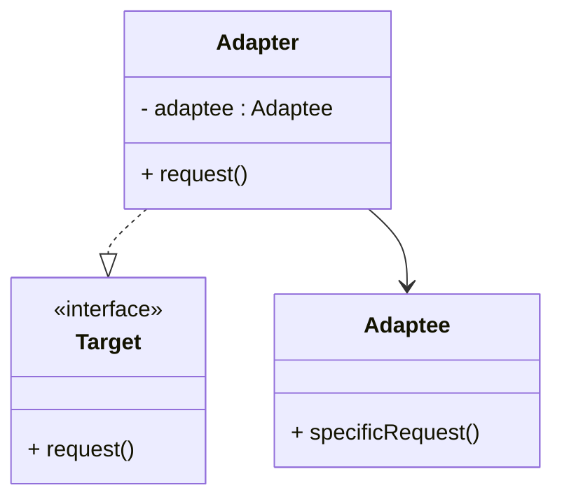
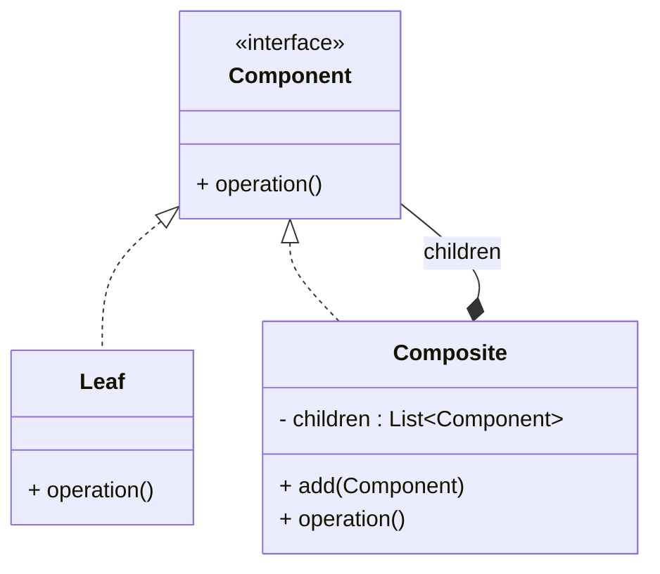

# Article 1-2-2 : Patterns de structure : composition des classes et objets

## Introduction

Les **patterns de structure** traitent de la manière dont les classes et les objets sont combinés pour former des structures plus grandes et flexibles. Leur objectif est d’optimiser les relations entre composants afin de faciliter la réutilisation, la maintenance et l’extension du système.

---

## Qu’est-ce qu’un pattern de structure ?

Un pattern de structure offre des solutions pour organiser et composer les classes et objets afin de créer des architectures cohérentes, performantes et évolutives. Ils abordent notamment :

- L’héritage,
- La composition d’objets,
- La gestion des relations entre composants.

---

## Principaux patterns de structure

### 1. Adapter (ou Wrapper)

Permet à des classes incompatibles de collaborer en convertissant l’interface d’une classe en une autre attendue par le client.

**Exemple simplifié :**

```java
interface Target {
    void request();
}

class Adaptee {
    void specificRequest() {
        System.out.println("Adaptee specific request");
    }
}

class Adapter implements Target {
    private Adaptee adaptee;

    public Adapter(Adaptee a) {
        this.adaptee = a;
    }

    public void request() {
        adaptee.specificRequest();  // Traduction de l’appel
    }
}
```

### Diagramme Mermaid Adapter



---

### 2. Composite

Compose des objets en structures arborescentes pour représenter des hiérarchies partie-tout. Le client traite les objets composites et individuels de manière uniforme.

**Exemple simplifié :**

```java
interface Component {
    void operation();
}

class Leaf implements Component {
    public void operation() {
        System.out.println("Leaf operation");
    }
}

class Composite implements Component {
    private List<Component> children = new ArrayList<>();

    public void add(Component c) { children.add(c); }
    public void operation() {
        for (Component c : children) {
            c.operation();
        }
    }
}
```

### Diagramme Mermaid Composite



---

### 3. Decorator

Permet d’ajouter dynamiquement des responsabilités à un objet sans modifier son code. S’appuie sur la composition et délégué.

**Exemple simplifié :**

```java
interface Coffee {
    double cost();
}

class SimpleCoffee implements Coffee {
    public double cost() { return 2; }
}

class MilkDecorator implements Coffee {
    private Coffee coffee;

    public MilkDecorator(Coffee c) { coffee = c; }

    public double cost() { return coffee.cost() + 0.5; }
}
```

---

### 4. Facade

Propose une interface simplifiée à un ensemble complexe de classes, facilitant l’usage d’un sous-système.

---

## Résumé des principaux patterns de structure

| Pattern     | Description                                   | Cas d’usage typique                      |
|-------------|-----------------------------------------------|----------------------------------------|
| Adapter     | Faire collaborer des interfaces incompatibles | Plugin tiers, intégration legacy       |
| Composite   | Travailler uniformément sur feuilles et groupes | Gestion hiérarchique (ex: arbres UI)  |
| Decorator   | Ajouter/modifier dynamiquement des fonctionnalités | Ajout d’attributs ou comportements     |
| Facade      | Simplifier l’interface d’un sous-système      | Masquer la complexité technique         |

---

## Intérêt pour la conception logicielle

- Facilite la gestion des relations entre objets.
- Permet des architectures modulaires, évolutives et facilement testables.
- Encourage la composition plutôt que l’héritage, augmentant la flexibilité.

---

## Sources utilisées

- Refactoring Guru, "Structural Design Patterns", https://refactoring.guru/design-patterns/structural-patterns  
- Oracle, "Structural Patterns", https://docs.oracle.com/javase/tutorial/java/concepts/designpatterns.html  
- Wikipedia, "Structural pattern", https://en.wikipedia.org/wiki/Structural_pattern  

---

Les patterns de structure sont donc indispensables pour organiser la collaboration entre classes et objets dans un système complexe, tout en préservant souplesse et évolutivité.