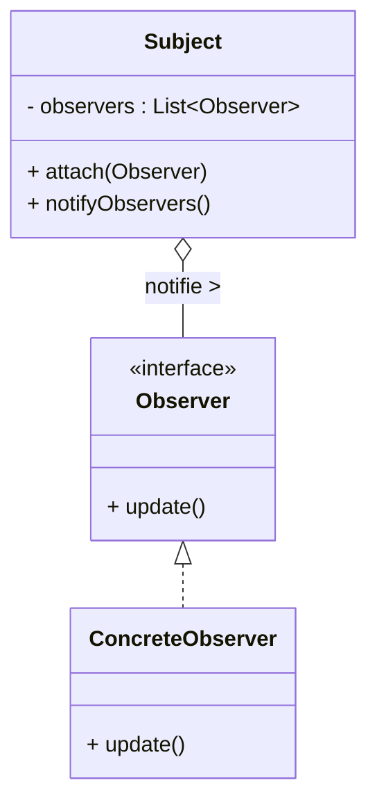

# Article 1-2-3 : Patterns de comportement : communication entre objets

## Introduction

Les **patterns de comportement** définissent la manière dont les objets interagissent et communiquent entre eux pour accomplir des tâches complexes. Ils organisent ces échanges afin d’améliorer la flexibilité, la réutilisabilité et la facilité d’évolution des applications orientées objet.

---

## Qu’est-ce qu’un pattern de comportement ?

Un pattern de comportement spécifie comment les objets coopèrent, distribuent les responsabilités, et échangent des messages tout en gardant leur indépendance. 

Ces patrons modulent la communication pour réduire le couplage, simplifier la coordination, et favoriser des architectures dynamiques.

---

## Principaux patterns de comportement

### 1. Observer

Permet à un objet (le sujet) de notifier automatiquement plusieurs objets dépendants (observateurs) lors d’un changement d’état.

**Exemple simplifié :**

```java
interface Observer {
    void update();
}

class Subject {
    private List<Observer> observers = new ArrayList<>();

    public void attach(Observer o) {
        observers.add(o);
    }

    public void notifyObservers() {
        for (Observer o : observers) {
            o.update();
        }
    }
}
```

### Diagramme Mermaid Observer



---

### 2. Strategy

Définit une famille d’algorithmes interchangeables encapsulés dans des classes distinctes, permettant à un objet de modifier son comportement à l’exécution.

**Exemple :**

```java
interface Strategy {
    void execute();
}

class ConcreteStrategyA implements Strategy {
    public void execute() {
        System.out.println("Algorithme A");
    }
}

class Context {
    private Strategy strategy;

    public void setStrategy(Strategy s) {
        strategy = s;
    }

    public void executeStrategy() {
        strategy.execute();
    }
}
```

---

### 3. Command

Encapsule une requête sous forme d’objet, permettant ainsi de paramétrer des actions, de les stocker ou de les annuler.

---

### 4. Iterator

Permet d’accéder séquentiellement aux éléments d’une collection sans exposer sa structure interne.

---

### 5. Mediator

Centralise les interactions entre objets pour réduire les dépendances directes et faciliter la gestion des communications complexes.

---

## Bénéfices des patterns de comportement

- **Réduction du couplage** : Les objets communiquent via des interfaces définies, sans dépendance forte.
- **Extensibilité** : Les comportements peuvent être modifiés ou étendus facilement.
- **Clarté** : La répartition claire des responsabilités facilite la compréhension.
- **Modularité** : Favorise la décomposition des tâches complexes en interactions simples.

---

## Synthèse rapide

| Pattern    | Description                                | Exemple d’usage                    |
|------------|--------------------------------------------|----------------------------------|
| Observer   | Notification d’un changement à plusieurs | Système d’événements UI           |
| Strategy   | Algorithmes interchangeables               | Choix dynamique d’algorithme      |
| Command    | Encapsulation d’une action                 | File d’attente de commandes       |
| Iterator   | Parcours d’une collection                   | Parcours uniforme des collections |
| Mediator   | Centralisation des communications          | Gestion de workflow complexe      |

---

## Sources utilisées

- Refactoring Guru, "Behavioral Design Patterns", https://refactoring.guru/design-patterns/behavioral-patterns  
- Oracle, "Behavioral Patterns", https://docs.oracle.com/javase/tutorial/java/concepts/designpatterns.html  
- Wikipedia, "Behavioral pattern", https://en.wikipedia.org/wiki/Behavioral_pattern  

---

Les patterns de comportement modèlent la façon dont les objets collaborent en définissant des interactions standardisées, contribuant ainsi à la construction de logiciels modulaires, maintenables et évolutifs.