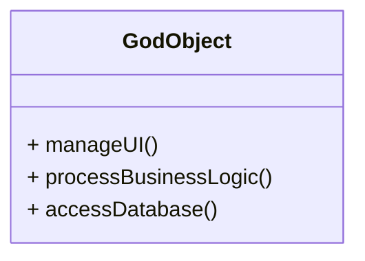

# Article 1-4-1 : Définition et exemples d'anti-patterns

## Introduction

Un **anti-pattern** désigne une solution récurrente à un problème de conception ou de développement, qui semble au premier abord pertinente mais qui, en réalité, engendre des effets négatifs, comme la complexité, une maintenance difficile ou une dette technique accrue. Reconnaître et comprendre les anti-patterns permet d’éviter des pièges courants dans la conception logicielle.

---

## Qu’est-ce qu’un anti-pattern ?

Contrairement aux design patterns qui proposent des solutions efficaces et éprouvées, un anti-pattern représente une pratique trompeuse ou une manière incorrecte de résoudre un problème, qui finit par causer plus de mal que de bien.

Ces comportements ou structures peuvent se manifester à différents niveaux : conception du code, architecture, gestion de projet.

---

## Exemples courants d’anti-patterns en conception logicielle

### 1. God Object (Objet Dieu)

Une classe qui concentre trop de responsabilités, devenant un point central excessivement complexe à gérer. Elle viole le principe de responsabilité unique (SRP).

**Exemple simplifié :**

```java
class GodObject {
    public void manageUI() { /* Code UI */ }
    public void processBusinessLogic() { /* Logique métier */ }
    public void accessDatabase() { /* Accès base de données */ }
}
```

*Effet :* Difficultés à modifier, tester ou réutiliser une classe trop gonflée.

---

### 2. Spaghetti Code

Un code désordonné, sans structure claire, avec une logique entremêlée, rendant la compréhension et la maintenance quasi impossibles.

---

### 3. Golden Hammer

Utiliser une solution connue, même si elle ne correspond pas au problème. Par exemple, appliquer toujours le même design pattern quel que soit le contexte.

---

### 4. Copy-Paste Programming

Dupliquer du code source au lieu de le refactoriser ou d’extraire une fonctionnalité partagée, ce qui induit une lourde maintenance.

---

### 5. Lava Flow

Code ou fonctionnalité qui persiste dans la base malgré qu’elle soit obsolète ou inutilisée, souvent par crainte de casser quelque chose.

---

## Diagramme Mermaid illustrant le God Object



---

## Comment éviter les anti-patterns ?

- Respecter les principes de conception, notamment SOLID.
- Favoriser la modularité et la séparation des responsabilités.
- Refactoriser régulièrement le code.
- Documenter clairement les choix techniques.
- S’appuyer sur les design patterns pertinents.

---

## Sources utilisées

- Refactoring Guru, "Anti-patterns", https://refactoring.guru/anti-patterns  
- Wikipedia, "Anti-pattern", https://en.wikipedia.org/wiki/Anti-pattern  
- Martin Fowler, "Refactoring: Improving the Design of Existing Code", https://martinfowler.com/books/refactoring.html  

---

## Conclusion

Reconnaître les anti-patterns est un élément clé pour garantir une bonne qualité du code. Leur identification précoce permet de corriger le tir avant que la dette technique ne devienne ingérable, favorisant ainsi des logiciels durables et évolutifs.