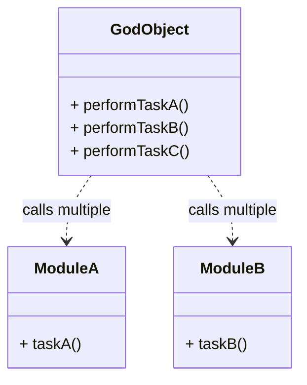

# Article 1-4-2 : Reconnaître les mauvaises pratiques courantes

## Introduction

Les mauvaises pratiques ou **anti-patterns** dans le développement logiciel peuvent sérieusement nuire à la qualité, la maintenabilité et la robustesse d’un projet. Savoir les identifier facilite la correction rapide et l’adoption de bonnes pratiques.

---

## Mauvaises pratiques courantes et leurs effets

### 1. Code Duplication (Duplication de code)

Le copier-coller de blocs fonctionnels identiques ou très similaires à plusieurs endroits.

**Conséquences :**  
- Maintenance laborieuse : un bug corrigé dans une copie peut rester dans les autres.  
- Volume de code inutilement plus important.

---

### 2. God Object (Class “Dieu”)

Une seule classe accumule la majeure partie des responsabilités.

**Problème :** Le code devient rigide, difficile à comprendre et modifier.

---

### 3. Shotgun Surgery (Chirurgie de fusil à pompe)

Pour modifier une fonctionnalité, il faut changer beaucoup de petites portions de code dispersées.

**Conséquence :** Forte propension aux erreurs lors des modifications.

---

### 4. Magic Numbers (Nombres magiques)

Utilisation de constantes littérales sans signification explicite dans le code.

**Exemple :**

```java
if (age > 18) { // 18 est un nombre magique
    // ...
}
```

*Il est préférable de définir une constante*:

```java
final int ADULT_AGE = 18;
if (age > ADULT_AGE) {
    // ...
}
```

---

### 5. Feature Envy (Envie de fonctionnalité)

Un objet accède trop aux données d’un autre objet pour réaliser son travail, ce qui rompt l’encapsulation.

---

### 6. Lava Flow

Code mort ou incompris qui reste dans le projet par peur de le supprimer.

---

### 7. Reinventing the Wheel

Implémenter soi-même des fonctionnalités standard plutôt que d’utiliser des bibliothèques éprouvées.

---

## Comment reconnaître ces mauvaises pratiques ?

- **Symptômes dans le code** : classes lourdes, duplication, dépendances trop fortes.  
- **Difficultés lors de l’évolution** : corrections répétées sur plusieurs fichiers, bugs fréquents après modification.  
- **Analyse statique automatique** : outils comme SonarQube, ESLint détectent certains anti-patterns.  
- **Revue de code rigoureuse** : détection humaine en contrôle qualité.

---

## Diagramme Mermaid : illustration d’un God Object et effet shotgun surgery



*Le God Object centralise trop les fonctionnalités, contrastant avec une architecture modulaire.*

---

## Bonnes pratiques pour limiter les mauvaises pratiques

- Appliquer le principe de responsabilité unique (SRP).  
- Refactoriser régulièrement le code pour éliminer les duplications.  
- Utiliser des constantes symboliques au lieu de nombres magiques.  
- Favoriser l’encapsulation et limiter l’accès direct aux données.  
- S’appuyer sur des bibliothèques standardisées.  
- Effectuer des revues de code systématiques.

---

## Sources utilisées

- Refactoring Guru, "Code Smells and Anti-patterns", https://refactoring.guru/smells  
- Martin Fowler, "Refactoring: Improving the Design of Existing Code", https://martinfowler.com/books/refactoring.html  
- Wikipedia, "Code Smell", https://en.wikipedia.org/wiki/Code_smell  
- SonarSource, "SonarQube documentation", https://docs.sonarqube.org/latest/analysis/code-smells/  

---

Reconnaître les mauvaises pratiques dans le code facilite leur suppression et permet d’adopter une architecture plus saine, facilitant ainsi la maintenance, l’évolution et la collaboration dans les projets logiciels.