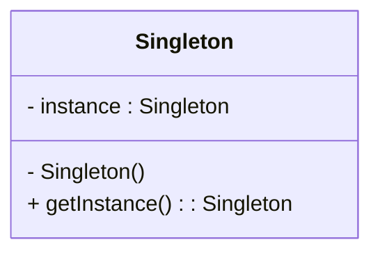

# Article 2-1-1 : Présentation du pattern Singleton

## Introduction

Le **pattern Singleton** est un pattern de création très utilisé en programmation orientée objet. Il garantit qu’une classe ne possède qu’une seule instance dans l’application et fournit un point d’accès global à cette instance. Ce pattern est utile lorsque la gestion d’une ressource partagée doit être centralisée.

---

## Description du pattern Singleton

Le Singleton définit une classe dont l’instanciation est contrôlée pour n’autoriser qu’un seul objet. Cela évite, par exemple, d'avoir plusieurs connexions simultanées à une base de données ou plusieurs gestionnaires de configuration diffusant des informations incohérentes.

**Caractéristiques clés :**

- Instance unique accessible globalement.
- Contrôle strict de la création d’objet.
- Souvent utilisé pour les ressources partagées (connexion base, cache, gestionnaire de logs).

---

## Implémentation classique en Java

```java
public class Singleton {
    // Instance unique et statique
    private static Singleton instance;

    // Constructeur privé empêche l'instanciation externe
    private Singleton() {}

    // Méthode accès à l'unique instance
    public static Singleton getInstance() {
        if (instance == null) {
            instance = new Singleton();
        }
        return instance;
    }
}
```

---

## Variante thread-safe (double-checked locking)

Dans les environnements multithread, l'implémentation ci-dessus peut créer plusieurs instances. On utilise alors une synchronisation plus fine :

```java
public class Singleton {
    private static volatile Singleton instance;

    private Singleton() {}

    public static Singleton getInstance() {
        if (instance == null) {
            synchronized(Singleton.class) {
                if (instance == null) {
                    instance = new Singleton();
                }
            }
        }
        return instance;
    }
}
```

---

## Diagramme Mermaid du pattern Singleton



---

## Utilisations et limites

**Utilisations classiques :**

- Gestion de configuration.
- Logger centralisé.
- Pool de connexion.
- Cache global.

**Limites à considérer :**

- Peut introduire un couplage fort entre les classes utilisant le singleton.  
- Difficultés pour tester (mocking, état global).  
- Risques en environnement multithread si mal conçu.

---

## Alternatives au Singleton

- Injection de dépendances avec un scope singleton.  
- Utiliser des objets immuables partagés.  
- Gestion de ressources via des conteneurs dédiés (ex : Spring).

---

## Sources utilisées

- Refactoring Guru, "Singleton Design Pattern", https://refactoring.guru/design-patterns/singleton  
- Oracle Java Tutorials, "Singleton Pattern", https://docs.oracle.com/javase/tutorial/java/javaOO/singleton.html  
- Wikipedia, "Singleton pattern", https://en.wikipedia.org/wiki/Singleton_pattern  

---

Le pattern Singleton offre une méthode simple pour contrôler la création d’une instance unique dans une application. Sa bonne utilisation demande toutefois une vigilance particulière sur les aspects de couplage, testabilité, et concurrence.