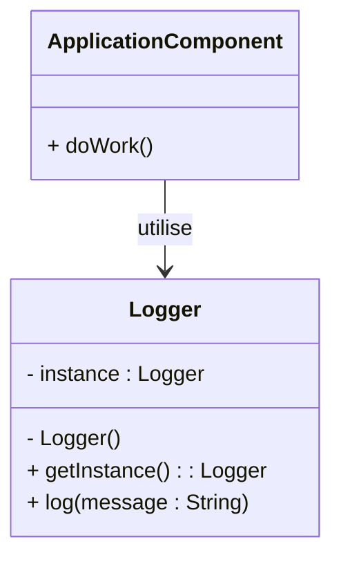

# Article 2-1-2 : Cas d'usage typiques du pattern Singleton

## Introduction

Le pattern **Singleton** est fréquemment utilisé pour garantir qu'une classe n'a qu'une seule instance dans l'application. Cette contrainte s'avère particulièrement utile pour la gestion de ressources uniques ou partagées, facilitant la cohérence et la coordination entre différentes parties du programme.

---

## Cas d'usage typiques du Singleton

### 1. Gestionnaire de configuration

Une application nécessite souvent un accès centralisé et uniforme à ses paramètres de configuration. Le Singleton facilite l'accès global à ces données sans recréer plusieurs objets.

**Exemple simplifié :**

```java
public class ConfigurationManager {
    private static ConfigurationManager instance;
    private Properties config;

    private ConfigurationManager() {
        config = new Properties();
        // Chargement des paramètres depuis un fichier
    }

    public static ConfigurationManager getInstance() {
        if (instance == null) {
            instance = new ConfigurationManager();
        }
        return instance;
    }

    public String getProperty(String key) {
        return config.getProperty(key);
    }
}
```

---

### 2. Logger centralisé

L’enregistrement des logs dans une application est une tâche que plusieurs objets réalisent. Le Singleton garantit que tous les logs transitent par une instance unique cohérente.

```java
public class Logger {
    private static Logger instance;

    private Logger() {
        // initialisation, ouverture fichier etc.
    }

    public static Logger getInstance() {
        if (instance == null) instance = new Logger();
        return instance;
    }

    public void log(String message) {
        System.out.println(message);
    }
}
```

---

### 3. Connexion à une base de données (exemple basique)

Maintenir une unique connexion (ou un pool géré) évite la surcharge et les conflits liés à la gestion de plusieurs connexions simultanées.

---

### 4. Cache global

Un cache partagé accessible depuis plusieurs composants permet d’éviter des recalculs coûteux et de stocker des données fréquemment utilisées.

---

## Diagramme Mermaid illustrant le pattern Singleton dans le cas d’un Logger



*Plusieurs composants de l’application accèdent au même Logger Singleton.*

---

## Précautions à prendre

- **Environnements multi-thread** : Utiliser des implémentations thread-safe pour éviter la création de plusieurs instances.  
- **Testabilité** : Le pattern peut rendre difficile le mocking ; des solutions incluent l’injection de dépendances.  
- **Couplage global** : Minimiser les dépendances directes au Singleton pour conserver modularité et flexibilité.

---

## Sources utilisées

- Refactoring Guru, "Singleton Design Pattern", https://refactoring.guru/design-patterns/singleton  
- Baeldung, "Understanding the Singleton Pattern in Java", https://www.baeldung.com/java-singleton  
- Oracle Tutorials, "Singleton Pattern", https://docs.oracle.com/javase/tutorial/java/javaOO/singleton.html  

---

Le pattern Singleton s’impose dans des scénarios nécessitant une instance unique partagée. Son usage raisonné assure une coordination fiable et simplifie la gestion de ressources communes dans les applications.