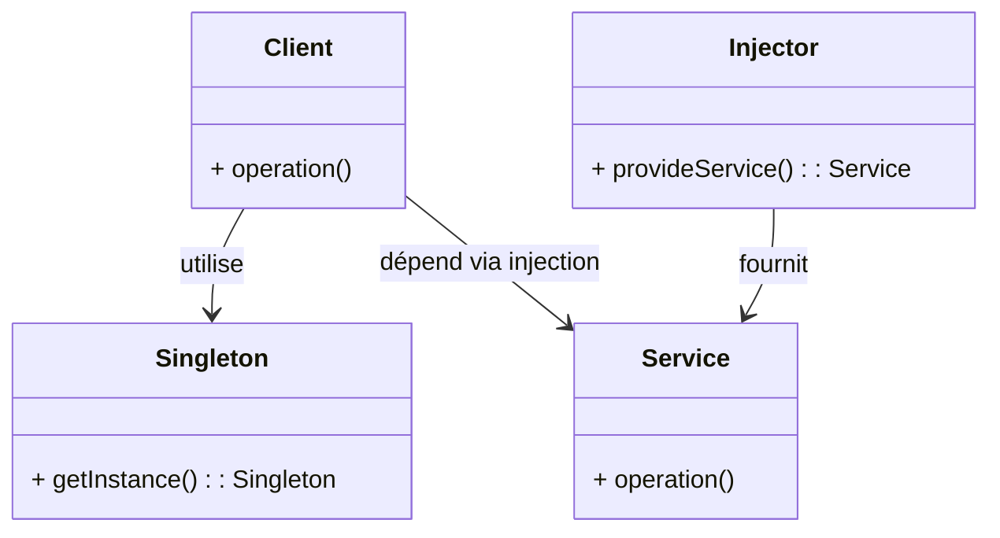

# Article 2-1-3 : Limites et alternatives modernes au Singleton

## Introduction

Le pattern **Singleton** est parfois perçu comme un anti-pattern en raison de limites inhérentes à son usage, notamment dans des architectures complexes ou multi-threadées. Identifier ses faiblesses et explorer des alternatives modernes permet de concevoir des logiciels plus modulaires, testables et évolutifs.

---

## Limites du pattern Singleton

### 1. Couplage fort et global

Le Singleton instaure une instance globale accessible partout, ce qui crée un couplage fort, rendant difficile le remplacement ou le mock lors des tests unitaires.

---

### 2. Difficultés de testabilité

Les Singletons conservent un état global partagé, ce qui peut introduire des effets de bord entre tests et compliquer la mise en place de mocks ou stubs.

---

### 3. Problèmes en environnement multi-thread

Une mauvaise implémentation du Singleton peut entraîner la création de plusieurs instances en parallèle, compromettant sa garantie d’unicité.

---

### 4. Gestion de la durée de vie et des dépendances

Le Singleton contrôle lui-même sa création et destruction, limitant le contrôle global sur la durée de vie des objets dans une application, problème aggravé dans des architectures complexes.

---

## Alternatives modernes au Singleton

### 1. Injection de dépendances (DI)

L’**injection de dépendances** est une approche qui externalise la création des objets vers un conteneur ou la couche d’initialisation.

**Avantages :**

- Contrôle précis sur l’instanciation et durée de vie.  
- Facilite le remplacement et le test grâce à la fourniture d’implémentations alternatives.  

**Exemple simple en pseudo-code :**

```java
class Service {
    private final Config config;
    public Service(Config config) {
        this.config = config;
    }
}
```

Ici `Config` est injecté, favorisant la modularité et la testabilité.

---

### 2. Utilisation de classes utilitaires statiques

Pour certains cas (ex : gestion de logs), une suite de méthodes statiques peut suffire sans la complexité d’un Singleton.

---

### 3. Objets immutables partagés

Créer des objets immuables à la création de l’application qui peuvent être passés en référence, assurant l’absence d’effets de bord.

---

### 4. Conteneurs de services (Service Locator)

Appuyés sur un conteneur central, ils fournissent des instances singleton ou à durée de vie contrôlée, déléguant le cycle de vie sans exposer d’accès global directement.

---

## Diagramme Mermaid : comparaison Singleton vs Injection de dépendances



---

## Synthèse

| Aspect                   | Singleton                       | Injection de dépendances          |
|--------------------------|--------------------------------|----------------------------------|
| Contrôle d'instance      | Automatique, unique             | Externe, configurable            |
| Testabilité              | Difficile (état global)         | Facile (mock facile)             |
| Couplage                 | Fort, global                   | Faible, explicite                |
| Concurrence              | Risques si mal implémenté      | Géré par conteneur               |

---

## Sources utilisées

- Martin Fowler, "Inversion of Control Containers and the Dependency Injection pattern", https://martinfowler.com/articles/injection.html  
- Refactoring Guru, "Singleton Anti-pattern", https://refactoring.guru/design-patterns/singleton#anti-pattern  
- Baeldung, "Singleton Design Pattern and Its Alternatives", https://www.baeldung.com/java-singleton  
- Wikipedia, "Singleton pattern", https://en.wikipedia.org/wiki/Singleton_pattern  

---

Le Singleton reste un pattern utile mais doit être utilisé avec prudence, en privilégiant pour les projets complexes des alternatives comme l’injection de dépendances, qui améliorent modularité, testabilité et maintenance.