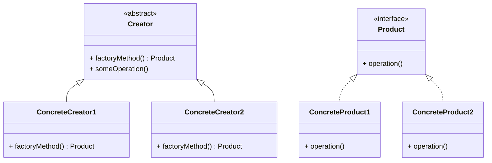

# Article 2-2-1 : Principe de Factory Method

## Introduction

Le **Factory Method** est un pattern de création qui permet de déléguer l’instanciation d’objets à des sous-classes. Il définit une interface pour créer un objet, mais laisse aux classes dérivées le soin de décider quelle classe concrète instancier, favorisant ainsi la flexibilité et l’extensibilité.

---

## Principe du Factory Method

Ce pattern répond au problème classique : comment créer des objets sans coupler le code client à des classes concrètes. Plutôt que d'utiliser directement un constructeur, le client appelle une méthode de création (factory method), que les sous-classes peuvent redéfinir pour décider réellement quel produit créer.

### Structure basique

- **Produit (Product)** : interface ou classe abstraite décrivant le type d’objets à créer.
- **ConcreteProduct** : implémentation concrète de Product.
- **Créateur (Creator)** : classe abstraite qui déclare la méthode factory (factoryMethod()), appelée par le client.
- **ConcreteCreator** : dérive de Creator et implémente la factoryMethod() pour instancier ConcreteProduct.

---

## Exemple en Java

```java
// Produit
interface Transport {
    void deliver();
}

// Produits concrets
class Truck implements Transport {
    public void deliver() {
        System.out.println("Delivery by land in a truck");
    }
}

class Ship implements Transport {
    public void deliver() {
        System.out.println("Delivery by sea in a ship");
    }
}

// Créateur abstrait
abstract class Logistics {
    // Méthode factory
    abstract Transport createTransport();

    public void planDelivery() {
        Transport transport = createTransport();
        transport.deliver();
    }
}

// Créateurs concrets
class RoadLogistics extends Logistics {
    Transport createTransport() {
        return new Truck();
    }
}

class SeaLogistics extends Logistics {
    Transport createTransport() {
        return new Ship();
    }
}

// Utilisation
public class Main {
    public static void main(String[] args) {
        Logistics logistics = new RoadLogistics();
        logistics.planDelivery();

        logistics = new SeaLogistics();
        logistics.planDelivery();
    }
}
```

---

## Diagramme Mermaid illustrant Factory Method



---

## Avantages du Factory Method

- Découplage du code client et des classes concrètes.  
- Facilitation de l’ajout de nouveaux types d’objets sans modifier le code client.  
- Respect du principe OCP (Open/Closed Principle).

---

## Contextes typiques d’utilisation

- Lorsque la classe ne peut pas anticiper le type concret d’objets dont elle aura besoin.  
- Pour isoler la création dans une hiérarchie de classes.  
- Dans des frameworks ou bibliothèques fournissant des points d’extension par héritage.

---

## Sources utilisées

- Refactoring Guru, "Factory Method", https://refactoring.guru/design-patterns/factory-method  
- Wikipedia, "Factory method pattern", https://en.wikipedia.org/wiki/Factory_method_pattern  
- Gamma et al., "Design Patterns: Elements of Reusable Object-Oriented Software", Addison-Wesley, 1994.

---

Le pattern Factory Method offre une manière puissante d’injecter de la souplesse dans la conception orientée objet en isolant la création des objets à partir d’une hiérarchie, facilitant ainsi l’adaptabilité et la maintenance du code.