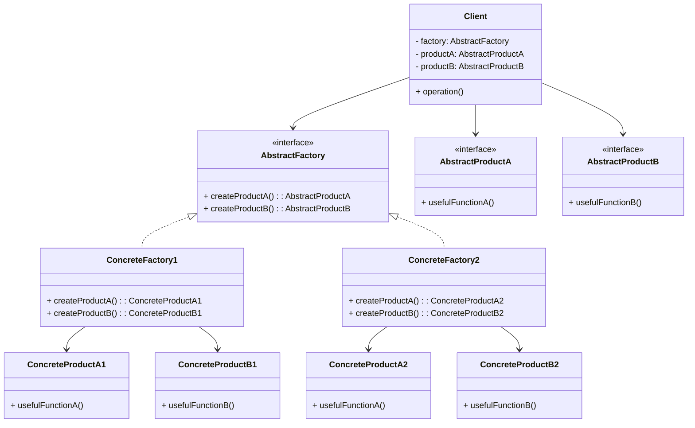

# Article 2-2-2 : Principe d'Abstract Factory

## Introduction

L’**Abstract Factory** est un pattern de création permettant de fournir une interface pour créer des familles d'objets liés ou dépendants sans spécifier leurs classes concrètes. À la différence du Factory Method, qui crée un seul type de produit, Abstract Factory génère plusieurs produits connexes qui doivent fonctionner ensemble.

---

## Principe du pattern Abstract Factory

L’Abstract Factory définit une interface pour créer un ensemble d’objets produits qui appartiennent à une même famille. Le client utilise cette interface sans se soucier des classes concrètes instanciées, garantissant la cohérence des produits associés.

### Composants clés :

- **AbstractFactory** : interface déclarant des méthodes pour créer chaque type de produit.  
- **ConcreteFactory** : implémente AbstractFactory, crée les objets concrets d'une famille spécifique.  
- **AbstractProduct** : interfaces ou classes abstraites pour chaque type de produit.  
- **ConcreteProduct** : implémentations concrètes des AbstractProducts.  
- **Client** : utilise l’AbstractFactory et les AbstractProducts, ignorants des classes concrètes.

---

## Exemple en Java : GUI kit multi-plateforme

Supposons la création d’une interface graphique adaptative entre Windows et MacOS, produisant des boutons et des cases à cocher spécifiques à chaque OS.

```java
// Produits abstraits
interface Button {
    void paint();
}

interface Checkbox {
    void paint();
}

// Produits concrets Windows
class WindowsButton implements Button {
    public void paint() {
        System.out.println("Render a button in Windows style.");
    }
}

class WindowsCheckbox implements Checkbox {
    public void paint() {
        System.out.println("Render a checkbox in Windows style.");
    }
}

// Produits concrets MacOS
class MacOSButton implements Button {
    public void paint() {
        System.out.println("Render a button in MacOS style.");
    }
}

class MacOSCheckbox implements Checkbox {
    public void paint() {
        System.out.println("Render a checkbox in MacOS style.");
    }
}

// Abstract Factory
interface GUIFactory {
    Button createButton();
    Checkbox createCheckbox();
}

// Concrete Factory Windows
class WindowsFactory implements GUIFactory {
    public Button createButton() {
        return new WindowsButton();
    }
    public Checkbox createCheckbox() {
        return new WindowsCheckbox();
    }
}

// Concrete Factory MacOS
class MacOSFactory implements GUIFactory {
    public Button createButton() {
        return new MacOSButton();
    }
    public Checkbox createCheckbox() {
        return new MacOSCheckbox();
    }
}

// Client
class Application {
    private Button button;
    private Checkbox checkbox;

    public Application(GUIFactory factory) {
        button = factory.createButton();
        checkbox = factory.createCheckbox();
    }

    public void paint() {
        button.paint();
        checkbox.paint();
    }
}

// Utilisation
public class Demo {
    public static void main(String[] args) {
        GUIFactory factory;
        String osName = System.getProperty("os.name").toLowerCase();

        if (osName.contains("mac")) {
            factory = new MacOSFactory();
        } else {
            factory = new WindowsFactory();
        }

        Application app = new Application(factory);
        app.paint();
    }
}
```

---

## Diagramme Mermaid illustrant Abstract Factory



---

## Avantages du pattern Abstract Factory

- Assure la cohérence des produits créés dans une même famille.  
- Encapsule la création d’objets complexes.  
- Facilite l’extension en ajoutant de nouvelles familles sans modifier le client.  
- Favorise l’indépendance vis-à-vis des classes concrètes.

---

## Cas d’utilisation classiques

- Création d’interfaces graphiques multi-plateformes.  
- Systèmes nécessitant la création d’objets liés entre eux (ex : widgets UI, bases de données, services).  
- Lorsqu’une famille d’objets doit être utilisée ensemble et maintenue cohérente.

---

## Sources utilisées

- Refactoring Guru, "Abstract Factory", https://refactoring.guru/design-patterns/abstract-factory  
- Wikipedia, "Abstract factory pattern", https://en.wikipedia.org/wiki/Abstract_factory_pattern  
- Gamma et al., "Design Patterns: Elements of Reusable Object-Oriented Software", Addison-Wesley, 1994.

---

Le pattern Abstract Factory est une solution puissante pour gérer la création d’ensembles cohérents d’objets sans exposer leur classe concrète, favorisant ainsi la modularité, la flexibilité et la maintenabilité du code.