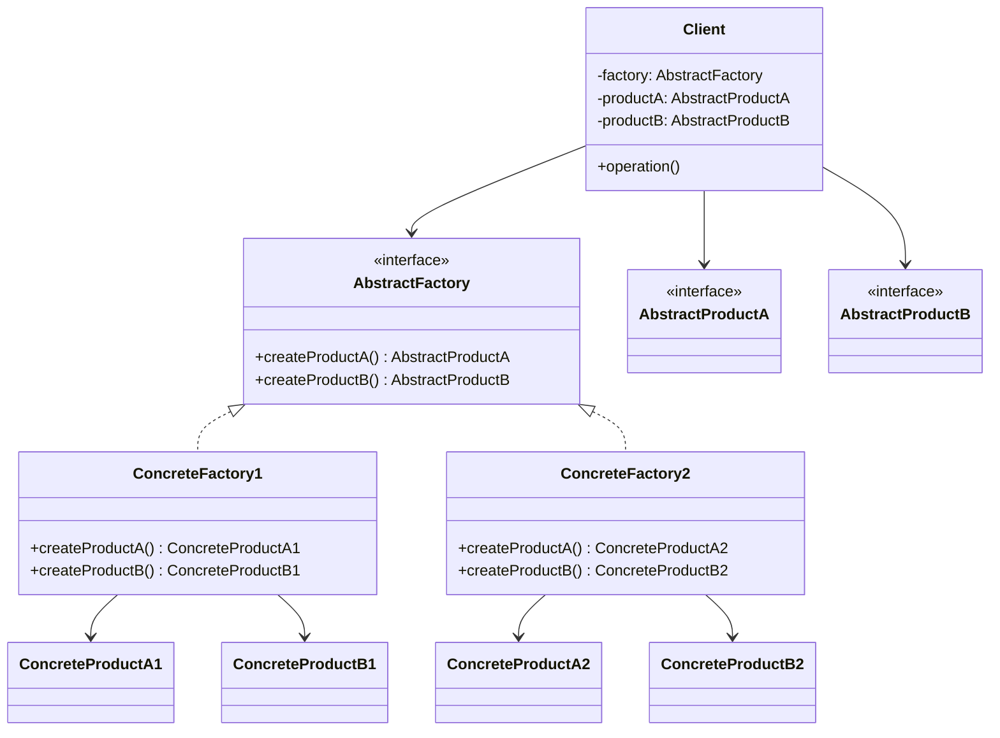

# Article 2-2-3 : Découplage de l'instanciation avec Factory Method et Abstract Factory

## Introduction

Dans la conception logicielle orientée objet, **découpler l’instanciation des objets** des clients qui les utilisent est une pratique clé pour améliorer la flexibilité, la maintenabilité et l’évolutivité du code. Les patterns **Factory Method** et **Abstract Factory** sont des solutions éprouvées qui permettent d’atteindre ce découplage.

---

## Pourquoi découpler l’instanciation ?

Instancier directement des classes concrètes à l’intérieur du code client crée une dépendance forte. Toute modification ou extension impose la modification du client, ce qui porte atteinte au principe de responsabilité unique et complique l’évolutivité.

Le découplage consiste à isoler la logique de création des objets dans des classes ou méthodes spécifiques (factories), laissant le client travailler uniquement avec des interfaces ou classes abstraites.

---

## Factory Method et découplage

Le **Factory Method** procède en déléguant la création d’un objet à une méthode que les sous-classes vont redéfinir.

- La classe abstraite ou la superclasse définit la méthode factory, avec un type abstrait en retour.  
- Les sous-classes créent des objets concrets sans que le client sache à quelle classe il s'adresse.

Cela permet au client d'utiliser des objets sans connaître leur classe exacte.

### Exemple simplifié

```java
abstract class Dialog {
    abstract Button createButton();

    void render() {
        Button okButton = createButton();
        okButton.onClick();
        okButton.render();
    }
}

class WindowsDialog extends Dialog {
    Button createButton() {
        return new WindowsButton();
    }
}

class HtmlDialog extends Dialog {
    Button createButton() {
        return new HtmlButton();
    }
}
```

Ici, `Dialog` utilise une factoryMethod `createButton()` pour obtenir une instance de `Button`. Le client appelle `render()` sans connaître la classe concrète de Button utilisée.

---

## Abstract Factory et découplage

L’**Abstract Factory** étend ce principe en fournissant une interface pour créer plusieurs objets liés, souvent regroupés en familles.

- Permet de s’assurer que les objets créés ensemble sont compatibles.  
- Permet d’échanger facilement toute une famille de produits sans modifier le client.

### Exemple simplifié

```java
interface GUIFactory {
    Button createButton();
    Checkbox createCheckbox();
}

class MacOSFactory implements GUIFactory {
    public Button createButton() { return new MacOSButton(); }
    public Checkbox createCheckbox() { return new MacOSCheckbox(); }
}

class WindowsFactory implements GUIFactory {
    public Button createButton() { return new WindowsButton(); }
    public Checkbox createCheckbox() { return new WindowsCheckbox(); }
}

class Application {
    private Button button;
    private Checkbox checkbox;

    public Application(GUIFactory factory) {
        this.button = factory.createButton();
        this.checkbox = factory.createCheckbox();
    }

    public void renderUI() {
        button.render();
        checkbox.render();
    }
}
```

Le client `Application` ne connaît que l’interface `GUIFactory` et les interfaces produits, pas leurs implémentations concrètes.

---

## Diagramme Mermaid résumé du découplage



---

## Bénéfices du découplage via Factory Method et Abstract Factory

- **Modularité accrue :** le client est indépendant des classes concrètes.  
- **Facilité d’extension :** ajouter un nouveau produit ne nécessite pas de modifier le client.  
- **Respect des principes SOLID :** notamment le principe Ouvert/Fermé (OCP) et la responsabilité unique.  
- **Interopérabilité de familles de produits :** garantie d’utiliser des objets compatibles au sein d’une même famille.  

---

## Sources utilisées

- Refactoring Guru, “Factory Method”, https://refactoring.guru/design-patterns/factory-method  
- Refactoring Guru, “Abstract Factory”, https://refactoring.guru/design-patterns/abstract-factory  
- Gamma et al., “Design Patterns: Elements of Reusable Object-Oriented Software”, Addison Wesley, 1994  
- Oracle Java Tutorials, https://docs.oracle.com/javase/tutorial/java/IandI/patterns.html  

---

Le découplage de l’instanciation est un levier puissant pour construire des architectures flexibles et évolutives, et les patterns Factory Method et Abstract Factory constituent des patterns de référence pour y parvenir efficacement.