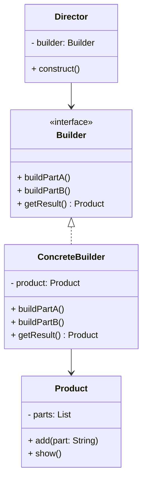

# Article 2-3-1 : Construction d'objets complexes pas à pas avec le pattern Builder

## Introduction

La création d’objets complexes composés de nombreux attributs, parfois optionnels, peut devenir rapidement problématique si tous les paramètres doivent être passés dans un constructeur long ou si des variations d'initialisation sont nombreuses. Le **pattern Builder** propose une méthode claire et flexible pour construire ces objets étape par étape, évitant ainsi la prolifération des constructeurs et améliorant la lisibilité.

---

## Principe du pattern Builder

Le Builder sépare la construction d’un objet complexe de sa représentation, permettant à un même processus de construction de créer différentes représentations. Il comporte généralement les rôles suivants :

- **Builder** : interface ou classe abstraite déclarant les étapes de construction.  
- **ConcreteBuilder** : implémente le Builder et assemble progressivement le produit.  
- **Director** (optionnel) : orchestration des étapes via le Builder.  
- **Produit (Product)** : l’objet complexe à construire.

Le client utilise le builder pour construire un objet sans connaître les détails de l'assemblage.

---

## Exemple simple en Java

Imaginons la construction d’une classe `Pizza` avec plusieurs options (taille, garnitures, sauce, etc.).

```java
class Pizza {
    private String size;
    private boolean cheese;
    private boolean pepperoni;
    private boolean bacon;

    private Pizza(PizzaBuilder builder) {
        this.size = builder.size;
        this.cheese = builder.cheese;
        this.pepperoni = builder.pepperoni;
        this.bacon = builder.bacon;
    }

    public static class PizzaBuilder {
        private String size;
        private boolean cheese;
        private boolean pepperoni;
        private boolean bacon;

        public PizzaBuilder(String size) {
            this.size = size;
        }

        public PizzaBuilder addCheese() {
            this.cheese = true;
            return this;
        }

        public PizzaBuilder addPepperoni() {
            this.pepperoni = true;
            return this;
        }

        public PizzaBuilder addBacon() {
            this.bacon = true;
            return this;
        }

        public Pizza build() {
            return new Pizza(this);
        }
    }

    @Override
    public String toString() {
        return "Pizza [size=" + size + ", cheese=" + cheese + ", pepperoni=" + pepperoni + ", bacon=" + bacon + "]";
    }
}

// Utilisation
public class Main {
    public static void main(String[] args) {
        Pizza pizza = new Pizza.PizzaBuilder("Large")
                         .addCheese()
                         .addPepperoni()
                         .build();
        System.out.println(pizza);
    }
}
```

Ce pattern favorise une syntaxe fluide (`fluent interface`) et une construction explicite.

---

## Diagramme Mermaid illustrant le pattern Builder



---

## Bénéfices du pattern Builder

- Construction progressive et contrôlée d’objets complexes.  
- Lisibilité améliorée grâce au « fluent interface ».  
- Facilite la création d’objets immuables avec de nombreux paramètres.  
- Moins de surcharge de constructeurs (constructors overloading).  
- Possibilité de création de plusieurs représentations d’un même produit.

---

## Contextes typiques d’utilisation

- Objets avec beaucoup d’attributs optionnels (ex : configuration, objets graphiques).  
- Création de structures immuables nécessitant une configuration précise.  
- Lorsque la fabrication passe par plusieurs étapes indépendantes.

---

## Sources utilisées

- Refactoring Guru, "Builder Design Pattern", https://refactoring.guru/design-patterns/builder  
- Wikipedia, "Builder pattern", https://en.wikipedia.org/wiki/Builder_pattern  
- Martin Fowler, "Builder", https://martinfowler.com/ieeeSoftware/Builder.pdf  

---

Le pattern Builder introduit un mécanisme simple et puissant pour maîtriser la construction d’objets complexes tout en améliorant la clarté du code. Il s’insère particulièrement bien dans des contextes exigeant flexibilité et robustesse dans l’instanciation.