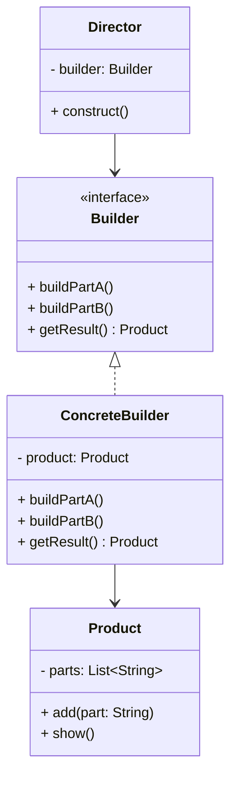

# Article 2-3-2 : Avantages et cas d'utilisation du pattern Builder

## Introduction

Le **pattern Builder** facilite la construction d'objets complexes, particulièrement lorsqu'ils comportent de nombreux paramètres optionnels ou que leur création nécessite plusieurs étapes. Au-delà de sa simplicité d’utilisation, il offre des avantages essentiels pour la conception, la maintenance et la flexibilité du code.

---

## Avantages du pattern Builder

### 1. Gestion claire des objets complexes

Le Builder permet d’éviter la prolifération de constructeurs avec un grand nombre de paramètres (problème des "constructors telescoping") en proposant une construction étape par étape.

### 2. Fluent interface pour une syntaxe lisible

La plupart des implémentations du Builder utilisent une interface fluide, offrant une syntaxe proche du langage naturel qui rend le code client plus compréhensible et maintenable.

### 3. Création d’objets immuables

Le Builder favorise la création d’objets immuables en encapsulant la construction dans un builder, garantissant qu’une fois construit, l’objet ne soit plus modifiable.

### 4. Séparation claire entre la représentation et la construction

Il sépare la logique de construction d’un objet de sa représentation finale, rendant possible la création de différentes variantes d’un objet complexe via différents builders.

### 5. Flexibilité et extension aisée

Quand les besoins évoluent (ajout d’attributs ou étapes nouvelles), on peut facilement adapter ou étendre le builder sans impacter le code client.

---

## Cas d'utilisation typiques

### a) Objets avec de nombreux paramètres optionnels

Exemple classique : Configuration d’objets comme une classe `Pizza`, `Voiture`, ou `Document` avec plusieurs options configurables.

---

### b) Création d’objets immuables

Par exemple, les classes Java `StringBuilder` ou les objets créés via `java.time` utilisent un style de construction qui s’inspire du Builder.

---

### c) Construction d’objets composés ou hiérarchiques

Lorsque l’objet est la composition complexe d’autres sous-objets (ex. construction d’interface utilisateur ou document XML/JSON).

---

### d) Processus de construction en étapes contrôlées

Il est utile lorsque l'ordre des étapes de construction importe, ou que certaines étapes dépendent d’autres (ex : construction d’une maison avec fondations, murs, toiture).

---

## Exemple : Configuration d'une voiture avec Builder (Java simplifié)

```java
public class Car {
    private String engine;
    private int seats;
    private boolean GPS;

    private Car(CarBuilder builder) {
        this.engine = builder.engine;
        this.seats = builder.seats;
        this.GPS = builder.GPS;
    }

    public static class CarBuilder {
        private String engine;
        private int seats;
        private boolean GPS;

        public CarBuilder engine(String engine) {
            this.engine = engine;
            return this;
        }

        public CarBuilder seats(int seats) {
            this.seats = seats;
            return this;
        }

        public CarBuilder GPS(boolean GPS) {
            this.GPS = GPS;
            return this;
        }

        public Car build() {
            return new Car(this);
        }
    }
}

// Utilisation
Car car = new Car.CarBuilder()
                .engine("V8")
                .seats(4)
                .GPS(true)
                .build();
```

---

## Diagramme Mermaid illustrant le pattern Builder



---

## Sources utilisées

- Refactoring Guru, "Builder design pattern", https://refactoring.guru/design-patterns/builder  
- Wikipedia, "Builder pattern", https://en.wikipedia.org/wiki/Builder_pattern  
- Baeldung, "Builder Design Pattern in Java", https://www.baeldung.com/java-builder-pattern  

---

Le pattern Builder est une réponse élégante et puissante aux défis de la création d’objets complexes, offrant un code clair, modulaire et facile à maintenir, notamment dans des contextes où la construction s’appuie sur de multiples paramètres et étapes.