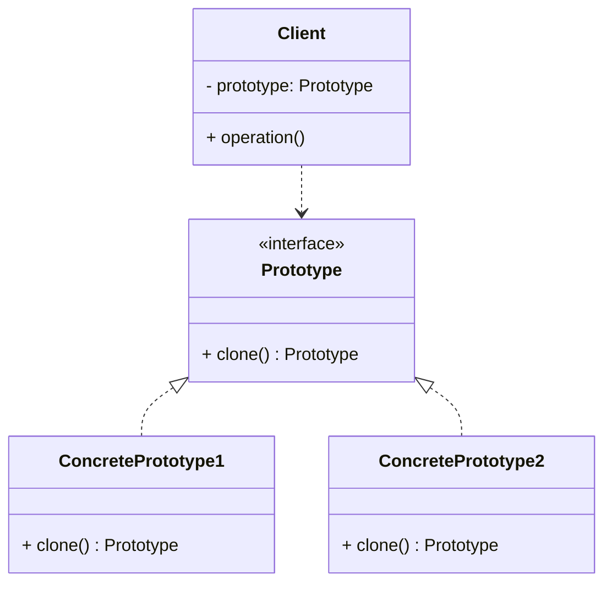

# Article 2-4-1 : Clonage d'objets avec le pattern Prototype

## Introduction

Le pattern **Prototype** facilite la création d’objets en copiant des instances existantes, plutôt qu’en construisant de nouveaux objets à partir de zéro. Cette technique est particulièrement utile pour créer rapidement des objets lourds à instancier ou quand un système doit supporter la création d’objets dont les classes ne sont pas connues à l’avance.

---

## Principe du pattern Prototype

Le Prototype repose sur le clonage : un objet sert de modèle (prototype), et on génère des copies de celui-ci. Le pattern définit une interface commune pour cloner des objets, souvent via une méthode `clone()`.

### Points clés

- **Prototype** : interface ou classe abstraite avec une méthode `clone()`.  
- **ConcretePrototype** : implémente la méthode de clonage.  
- Le client demande la création d’un nouvel objet en clonant le prototype au lieu d’instancier une classe directement.

---

## Clonage superficiel vs profond

- **Clonage superficiel (shallow copy)** : copie l’objet mais pas les objets référencés. Les références sont partagées.  
- **Clonage profond (deep copy)** : copie également les objets référencés, créant des instances indépendantes.

Le choix entre les deux dépend du besoin, mais souvent un clonage profond est nécessaire pour éviter les effets de bord.

---

## Exemple en Java

```java
public abstract class Prototype implements Cloneable {
    public Prototype clone() throws CloneNotSupportedException {
        return (Prototype) super.clone();
    }
}

public class Person extends Prototype {
    private String name;
    private int age;
    private Address address;

    public Person(String name, int age, Address address) {
        this.name = name;
        this.age = age;
        this.address = address;
    }

    // Clonage profond
    @Override
    public Person clone() throws CloneNotSupportedException {
        Person cloned = (Person) super.clone();
        cloned.address = address.clone(); // deep copy
        return cloned;
    }

    @Override
    public String toString() {
        return "Person{name='" + name + "', age=" + age + ", address=" + address + "}";
    }
}

public class Address implements Cloneable {
    private String city;
    private String street;

    public Address(String city, String street) {
        this.city = city;
        this.street = street;
    }

    @Override
    protected Address clone() throws CloneNotSupportedException {
        return (Address) super.clone();
    }

    @Override
    public String toString() {
        return "Address{city='" + city + "', street='" + street + "'}";
    }
}

// Utilisation
public class Main {
    public static void main(String[] args) throws CloneNotSupportedException {
        Address address = new Address("Paris", "Rue de Rivoli");
        Person original = new Person("Alice", 30, address);

        Person clone = original.clone();
        clone.address = new Address("Lyon", "Rue Saint-Jean"); // modifie clone sans impacter original

        System.out.println("Original: " + original);
        System.out.println("Clone: " + clone);
    }
}
```

---

## Diagramme Mermaid illustrant le pattern Prototype



---

## Avantages

- Évite la complexité d’instanciation via `new` (utile pour objets lourds).  
- Permet la duplication d'objets sans connaître leur classe exacte.  
- Favorise la création d’objets configurés ou prototypes réutilisables.  
- Réduit les coûts de création lorsqu’un clonage est plus efficace que l’instanciation.

---

## Cas d’utilisation

- Création d’objets complexes ou onéreux à instancier.  
- Systèmes où les classes sont instanciées dynamiquement (ex : éditeurs graphiques, frameworks).  
- Scénarios de personnalisation basée sur des prototypes configurés.

---

## Sources utilisées

- Refactoring Guru, "Prototype design pattern", https://refactoring.guru/design-patterns/prototype  
- Wikipedia, "Prototype pattern", https://en.wikipedia.org/wiki/Prototype_pattern  
- Gamma et al., "Design Patterns: Elements of Reusable Object-Oriented Software", Addison-Wesley, 1994.

---

Le pattern Prototype offre une méthode élégante pour cloner des objets existants, particulièrement adaptée à la gestion d’objets complexes, configurés ou dynamiques, tout en simplifiant le code client et en améliorant les performances de création.