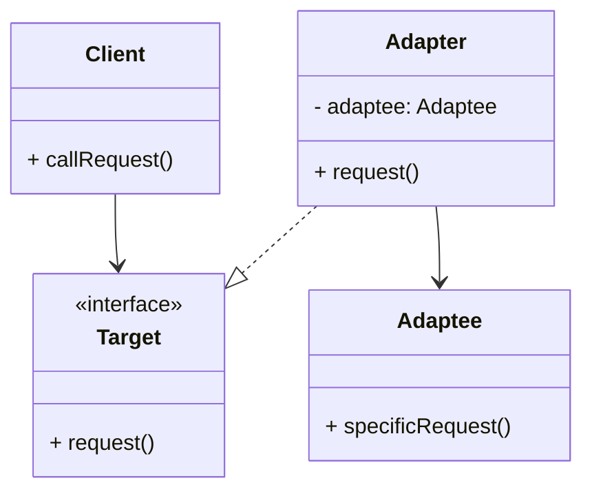

# Article 3-1-1 : Intégration de composants tiers avec le pattern Adapter

## Introduction

L’intégration de composants tiers dans une application peut souvent se heurter à des incompatibilités d’interfaces, rendant difficile leur réutilisation directe. Le **pattern Adapter** apporte une solution élégante en permettant d’adapter l’interface d’un composant existant à celle attendue par le client, facilitant ainsi l’interopérabilité sans modifier les composants originaux.

---

## Principe du pattern Adapter

Le pattern Adapter agit comme un **pont** entre deux interfaces incompatibles. Il permet à une classe (le client) d’utiliser une autre classe (le composant tiers) dont l’interface ne correspond pas, en fournissant une interface intermédiaire conforme aux attentes du client.

### Rôles principaux

- **Client** : code qui utilise l’interface cible.  
- **Target (interface cible)** : interface que le client attend.  
- **Adaptee** : classe tierce ou existante avec une interface incompatible.  
- **Adapter** : classe qui implémente l’interface Target et traduit les appels vers l’Adaptee.

Cette approche évite la duplication de code et préserve l’encapsulation.

---

## Exemple concret en Java

Imaginons un système qui travaille avec une interface `MediaPlayer`, mais doit intégrer un composant tiers qui ne supporte qu’une interface différente, `AdvancedMediaPlayer`.

```java
// Interface cible attendue par le client
interface MediaPlayer {
    void play(String audioType, String fileName);
}

// Interface du composant tiers
interface AdvancedMediaPlayer {
    void playVlc(String fileName);
    void playMp4(String fileName);
}

// Implémentations concrètes du composant tiers
class VlcPlayer implements AdvancedMediaPlayer {
    public void playVlc(String fileName) {
        System.out.println("Playing vlc file: " + fileName);
    }
    public void playMp4(String fileName) { }
}

class Mp4Player implements AdvancedMediaPlayer {
    public void playVlc(String fileName) { }
    public void playMp4(String fileName) {
        System.out.println("Playing mp4 file: " + fileName);
    }
}

// Adapter qui rend compatible AdvancedMediaPlayer et MediaPlayer
class MediaAdapter implements MediaPlayer {
    AdvancedMediaPlayer advancedMusicPlayer;

    public MediaAdapter(String audioType) {
        if(audioType.equalsIgnoreCase("vlc")) {
            advancedMusicPlayer = new VlcPlayer();
        } else if(audioType.equalsIgnoreCase("mp4")) {
            advancedMusicPlayer = new Mp4Player();
        }
    }

    public void play(String audioType, String fileName) {
        if(audioType.equalsIgnoreCase("vlc")) {
            advancedMusicPlayer.playVlc(fileName);
        } else if(audioType.equalsIgnoreCase("mp4")) {
            advancedMusicPlayer.playMp4(fileName);
        }
    }
}

// Client
class AudioPlayer implements MediaPlayer {
    MediaAdapter mediaAdapter;

    public void play(String audioType, String fileName) {
        if(audioType.equalsIgnoreCase("mp3")) {
            System.out.println("Playing mp3 file: " + fileName);
        } else if(audioType.equalsIgnoreCase("vlc") || audioType.equalsIgnoreCase("mp4")) {
            mediaAdapter = new MediaAdapter(audioType);
            mediaAdapter.play(audioType, fileName);
        } else {
            System.out.println("Invalid media. " + audioType + " format not supported");
        }
    }
}

// Utilisation
public class Main {
    public static void main(String[] args) {
        AudioPlayer player = new AudioPlayer();
        player.play("mp3", "song.mp3");
        player.play("mp4", "video.mp4");
        player.play("vlc", "movie.vlc");
        player.play("avi", "file.avi");
    }
}
```

---

## Diagramme Mermaid illustrant le pattern Adapter



---

## Avantages de l’Adapter dans l’intégration de composants tiers

- **Réutilisation sans modification** : permet d’utiliser des composants dont on ne peut pas changer le code.  
- **Flexibilité** : adapte plusieurs interfaces différentes à une interface commune.  
- **Découplage** : le client reste indépendant des classes concrètes des composants tiers.  
- **Gestion progressive de l’évolution** : facilite l’intégration de nouvelles bibliothèques sans refonte complète.

---

## Cas pratiques d’utilisation

- Intégration de bibliothèques externes avec des API différentes.  
- Migration progressive d’un ancien système vers un nouveau.  
- Adaptation d’interfaces entre modules développés par des équipes différentes.

---

## Sources utilisées

- Refactoring Guru, "Adapter design pattern", https://refactoring.guru/design-patterns/adapter  
- Baeldung, "Adapter Pattern in Java", https://www.baeldung.com/java-adapter-pattern  
- Gamma et al., "Design Patterns: Elements of Reusable Object-Oriented Software", Addison-Wesley, 1994.

---

Le pattern Adapter joue un rôle clé dans les architectures modulaires où la coexistence et l’interopérabilité de composants variés sont nécessaires. Il simplifie l’intégration de tiers tout en protégeant la structure existante du système.