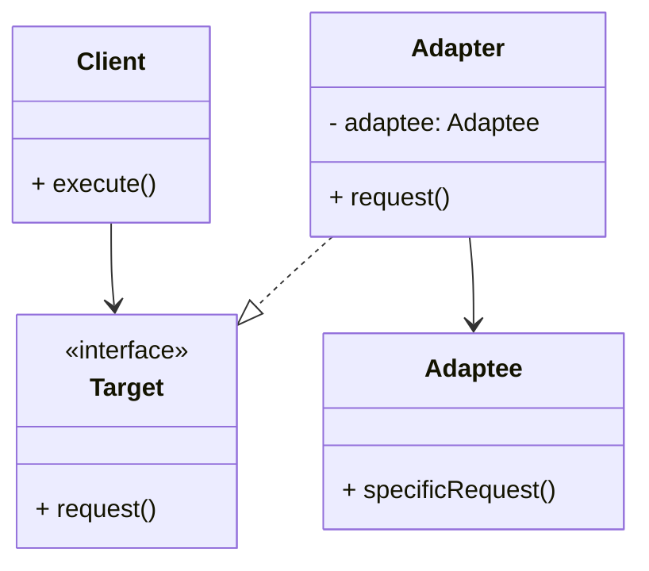

# Article 3-1-2 : Interopérabilité entre interfaces incompatibles avec le pattern Adapter

## Introduction

Dans le développement logiciel, il n’est pas rare de devoir faire collaborer des composants ou modules dont les interfaces diffèrent ou sont incompatibles. Le **pattern Adapter** permet de résoudre ce problème d’interopérabilité en fournissant une couche intermédiaire traduisant une interface en une autre, sans modifier les composants existants.

---

## Comprendre l’Interopérabilité via l’Adapter

Le pattern Adapter agit comme un traducteur entre deux interfaces incompatibles :

- Il **reçoit les appels clients** dans son interface attendue (Target).  
- Il **traduit ces appels** vers les méthodes d’une interface différente (Adaptee).  
- Le client interagit avec l’Adapter comme s’il utilisait la Target.

Cette approche supprime la nécessité de modifier soit le client, soit le composant tiers pour assurer la compatibilité.

---

## Formes d’Adapter

On distingue deux principaux types d'adapters :

- **Adapter par composition (objet)** : l’adapter contient une instance de l’adaptee et délègue les appels.  
- **Adapter par héritage (classe)** : l’adapter hérite de l’adaptee et implémente l’interface target, combinant les interfaces.

La composition reste la plus flexible et recommandée dans la majorité des cas.

---

## Exemple : Intégration entre interfaces incompatibles

Considérons un système qui utilise une interface `USPowerPlug` mais doit intégrer un composant qui ne gère que `EUPowerPlug`. L’adapter va permettre la connexion entre ces deux interfaces.

```java
// Interface américaine
interface USPowerPlug {
    void connect();
}

// Interface européenne
interface EUPowerPlug {
    void connectEuropean();
}

// Composant existant - prise européenne
class EUPowerDevice implements EUPowerPlug {
    public void connectEuropean() {
        System.out.println("Connected to European power plug.");
    }
}

// Adapter pour rendre compatible une prise EU à une prise US
class PowerPlugAdapter implements USPowerPlug {
    private EUPowerPlug euPlug;

    public PowerPlugAdapter(EUPowerPlug euPlug) {
        this.euPlug = euPlug;
    }

    public void connect() {
        System.out.print("Adapting US plug to European plug... ");
        euPlug.connectEuropean();
    }
}

// Client qui utilise l’interface USPowerPlug
public class Client {
    public static void main(String[] args) {
        EUPowerPlug euDevice = new EUPowerDevice();
        USPowerPlug adapter = new PowerPlugAdapter(euDevice);
        adapter.connect();  // Le client peut utiliser un composant EU via l’adapter US
    }
}
```

---

## Diagramme Mermaid illustrant l’interopérabilité avec Adapter



---

## Avantages clés dans l’Interopérabilité

- **Préservation des classes existantes** sans modification.  
- **Facilite l’intégration progressive** de nouveaux composants.  
- **Renforce la modularité** et la séparation des responsabilités.  
- **Permet l'utilisation de composants tiers ou legacy** malgré des interfaces différentes.

---

## Sources utilisées

- Refactoring Guru, "Adapter Design Pattern", https://refactoring.guru/design-patterns/adapter  
- Baeldung, "Adapter Pattern in Java", https://www.baeldung.com/java-adapter-pattern  
- Wikipedia, "Adapter Pattern", https://en.wikipedia.org/wiki/Adapter_pattern  

---

En résumé, le pattern Adapter est un outil puissant pour assurer l’interopérabilité entre systèmes ou composants avec des interfaces incompatibles, garantissant une intégration propre et maintenable dans un environnement logiciel hétérogène.