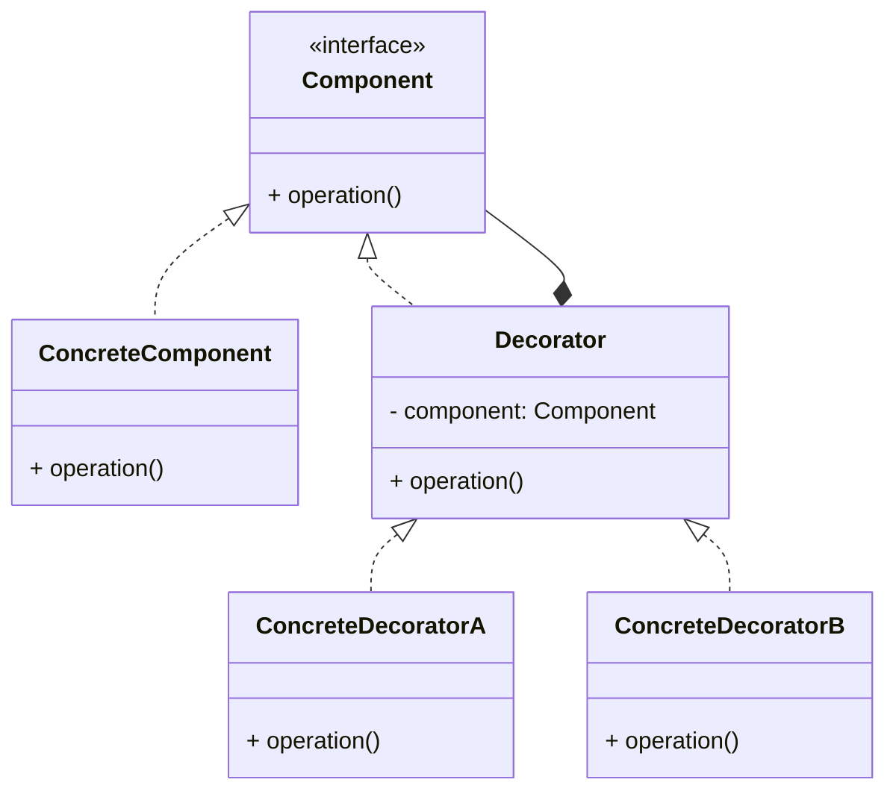

# Article 3-2-1 : Extension dynamique des comportements sans utiliser l'héritage avec le pattern Decorator

## Introduction

L’extension dynamique des comportements est un défi fréquent en développement logiciel. Le pattern **Decorator** offre une solution efficace en permettant d’enrichir ou modifier le comportement d’un objet à l’exécution, sans recourir à l’héritage statique. Cette approche favorise la flexibilité et l’adaptabilité dans la conception orientée objet.

---

## Principe du pattern Decorator

Le pattern Decorator consiste à **envelopper un objet existant** dans un autre objet (le décorateur), qui implémente la même interface que l’objet original et qui ajoute ou modifie des fonctionnalités avant ou après avoir délégué les appels à l’objet encapsulé.

### Caractéristiques principales

- Le décorateur et l’objet décoré partagent une interface commune.  
- Le décorateur garde une référence à l’objet décoré (composant).  
- Plusieurs décorateurs peuvent s’imbriquer pour cumuler les comportements.  
- Permet d’éviter une explosion de sous-classes dûe à la multiplication des combinaisons de fonctionnalités.

---

## Exemple concret en Java

Supposons un système de gestion de texte où on veut ajouter dynamiquement des fonctionnalités telles que le soulignement ou le surlignage d’un texte.

```java
// Composant de base
interface Text {
    String getContent();
}

// Classe concrète simple
class PlainText implements Text {
    private String content;

    public PlainText(String content) {
        this.content = content;
    }

    @Override
    public String getContent() {
        return content;
    }
}

// Décorateur abstrait
abstract class TextDecorator implements Text {
    protected Text decoratedText;

    public TextDecorator(Text decoratedText) {
        this.decoratedText = decoratedText;
    }
}

// Décorateur concret : soulignement
class UnderlineDecorator extends TextDecorator {
    public UnderlineDecorator(Text decoratedText) {
        super(decoratedText);
    }

    @Override
    public String getContent() {
        return "<u>" + decoratedText.getContent() + "</u>";
    }
}

// Décorateur concret : surlignage
class HighlightDecorator extends TextDecorator {
    public HighlightDecorator(Text decoratedText) {
        super(decoratedText);
    }

    @Override
    public String getContent() {
        return "<mark>" + decoratedText.getContent() + "</mark>";
    }
}

// Utilisation
public class Main {
    public static void main(String[] args) {
        Text simpleText = new PlainText("Hello, World!");

        Text underlined = new UnderlineDecorator(simpleText);
        Text highlighted = new HighlightDecorator(underlined);

        System.out.println("Simple: " + simpleText.getContent());
        System.out.println("Underlined: " + underlined.getContent());
        System.out.println("Highlighted and Underlined: " + highlighted.getContent());
    }
}
```

---

## Diagramme Mermaid représentant la structure du pattern Decorator



---

## Avantages du pattern Decorator

- **Extension dynamique** du comportement à l’exécution.  
- **Composition souple** des fonctionnalités par empilement de décorateurs.  
- Diminue la nécessité de multi-héritage ou de nombreuses sous-classes.  
- Respecte le principe de responsabilité unique et favorise le calcul fin des comportements.

---

## Cas d’usage fréquents

- Interfaces graphiques (ajout de bordures, scrollbars, effets visuels).  
- Flux de données (compression, chiffrement, logging).  
- Ajout de fonctionnalités transverses sans modifier les classes existantes.

---

## Sources utilisées

- Refactoring Guru, "Decorator Pattern", https://refactoring.guru/design-patterns/decorator  
- Oracle Java Tutorials, "Decorator Pattern", https://docs.oracle.com/javase/tutorial/java/IandI/decorator.html  
- Gamma et al., "Design Patterns: Elements of Reusable Object-Oriented Software", Addison-Wesley, 1994.

---

Le pattern Decorator est une alternative puissante à l’héritage, permettant d’enrichir dynamiquement des objets sans rigidité ni complexité excessive, en assurant un code propre et facile à maintenir.