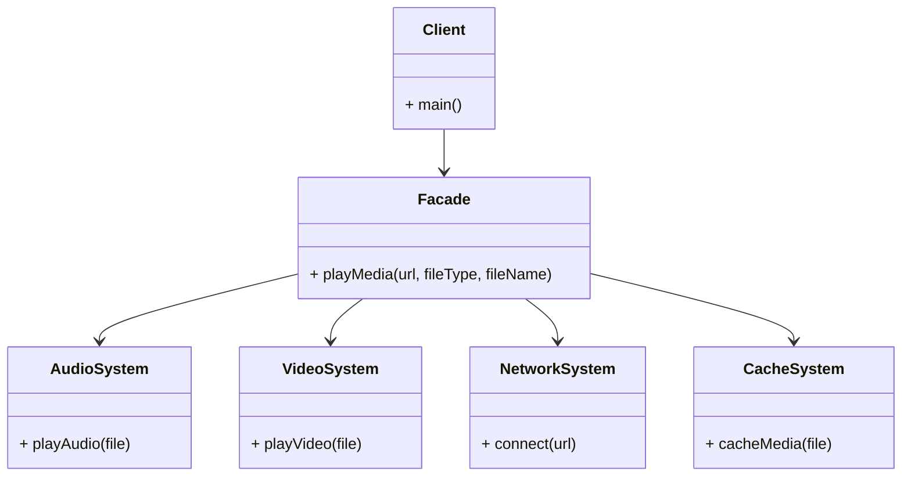

# Article 3-3-1 : Simplification d'interfaces complexes par une façade unique avec le pattern Facade

## Introduction

Lorsqu'un système logiciel intègre plusieurs sous-systèmes aux interfaces riches et complexes, s'interfacer directement avec chacun d'eux peut devenir lourd et source d'erreurs. Le **pattern Facade** propose une solution élégante : fournir une interface unifiée et simplifiée qui masque la complexité des sous-systèmes sous-jacents.

---

## Principes du pattern Facade

La façade agit comme un **point d'entrée unique** pour accéder à un ensemble de classes, en encapsulant interactions et dépendances. Elle offre :

- **Une abstraction nette** réduisant la charge cognitive du client.  
- **Un découplage** entre le client et les systèmes complexes.  
- **Une flexibilité** pour modifier la structure interne sans impacter le client.  

Contrairement à un adaptateur qui convertit une interface en une autre, la façade simplifie et organise l'accès à un ensemble de fonctionnalités.

---

## Exemple concret : Système de gestion multimédia

Supposons qu’un système utilise plusieurs sous-systèmes pour lire différents formats audio et vidéo, gérer la mise en réseau et le cache.

### Sous-systèmes

```java
class AudioSystem {
    public void playAudio(String file) {
        System.out.println("Lecture audio: " + file);
    }
}

class VideoSystem {
    public void playVideo(String file) {
        System.out.println("Lecture vidéo: " + file);
    }
}

class NetworkSystem {
    public void connect(String url) {
        System.out.println("Connexion au réseau : " + url);
    }
}

class CacheSystem {
    public void cacheMedia(String file) {
        System.out.println("Média mis en cache: " + file);
    }
}
```

### Façade unifiée

```java
class MediaFacade {
    private AudioSystem audio = new AudioSystem();
    private VideoSystem video = new VideoSystem();
    private NetworkSystem network = new NetworkSystem();
    private CacheSystem cache = new CacheSystem();

    public void playMedia(String url, String fileType, String fileName) {
        network.connect(url);
        cache.cacheMedia(fileName);

        if (fileType.equalsIgnoreCase("audio")) {
            audio.playAudio(fileName);
        } else if (fileType.equalsIgnoreCase("video")) {
            video.playVideo(fileName);
        } else {
            System.out.println("Format non supporté");
        }
    }
}
```

### Utilisation

```java
public class Client {
    public static void main(String[] args) {
        MediaFacade mediaFacade = new MediaFacade();
        mediaFacade.playMedia("http://media.example.com", "audio", "song.mp3");
        mediaFacade.playMedia("http://media.example.com", "video", "movie.mp4");
    }
}
```

---

## Diagramme Mermaid illustrant la façade



---

## Avantages du pattern Facade

- **Simplification** : offre une interface plus simple et cohérente.  
- **Encapsulation** : cache les détails complexes d’implémentation des sous-systèmes.  
- **Découplage** : réduit la dépendance du client aux classes internes.  
- **Évolutivité** : la structure interne peut évoluer indépendamment de l'interface client.

---

## Cas d’utilisation typiques

- Bibliothèques complexes exposant de multiples APIs.  
- Systèmes modulaires avec différents sous-systèmes.  
- Réduction de la complexité dans les architectures distribuées.

---

## Sources utilisées

- Refactoring Guru, "Facade design pattern", https://refactoring.guru/design-patterns/facade  
- Baeldung, "Facade Pattern in Java", https://www.baeldung.com/java-facade-pattern  
- Gamma et al., "Design Patterns: Elements of Reusable Object-Oriented Software", Addison-Wesley, 1994.

---

Le pattern Facade est un moyen élégant d'orchestrer la complexité d'un système via une interface simplifiée, améliorant ainsi la maintenabilité, la clarté du code et l'expérience développeur face à des architectures riches en composants.