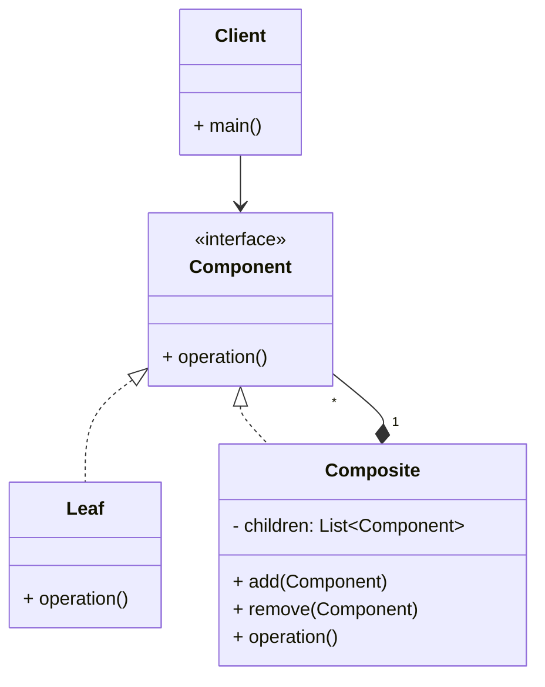

# Article 3-4-1 : Gestion d'arborescences et structures récursives avec le pattern Composite

## Introduction

Les structures de données hiérarchiques, telles que les arbres ou les graphes récursifs, représentent un défi de conception lorsqu'il s'agit de manipuler uniformément des objets simples et des compositions d'objets. Le **pattern Composite** facilite cette gestion en permettant de traiter des objets individuels et des groupes d'objets de manière homogène.

---

## Principe du pattern Composite

Le pattern Composite organise les objets sous forme d'une hiérarchie arborescente où :

- **Les feuilles** représentent des objets simples sans sous-éléments.  
- **Les composites** sont des objets qui contiennent des composants enfants, eux-mêmes composés ou feuilles.  
- Une interface commune est définie pour les composants afin d'uniformiser les opérations.

Ce pattern simplifie la manipulation récursive des structures complexes en traitant les objets et leurs compositions de manière uniforme.

---

## Structure du pattern Composite

| Élément        | Description                              |
|----------------|----------------------------------------|
| `Component`    | Interface abstraite commune.            |
| `Leaf`        | Objet simple (feuille) sans enfants.   |
| `Composite`   | Objet pouvant contenir d'autres composants (feuilles ou composites). |

---

## Exemple en Java : gestion de dossiers et fichiers

On modélise un système de fichiers où dossiers et fichiers sont traités uniformément.

```java
import java.util.ArrayList;
import java.util.List;

// Composant abstrait
interface FileSystemNode {
    void ls();
}

// Feuille
class File implements FileSystemNode {
    private String name;

    public File(String name) {
        this.name = name;
    }

    @Override
    public void ls() {
        System.out.println("File: " + name);
    }
}

// Composite
class Directory implements FileSystemNode {
    private String name;
    private List<FileSystemNode> children = new ArrayList<>();

    public Directory(String name) {
        this.name = name;
    }

    public void add(FileSystemNode node) {
        children.add(node);
    }

    public void remove(FileSystemNode node) {
        children.remove(node);
    }

    @Override
    public void ls() {
        System.out.println("Directory: " + name);
        for (FileSystemNode child : children) {
            child.ls();
        }
    }
}

// Utilisation
public class Client {
    public static void main(String[] args) {
        Directory root = new Directory("root");
        root.add(new File("file1.txt"));

        Directory subDir = new Directory("subdir");
        subDir.add(new File("file2.txt"));

        root.add(subDir);

        root.ls();
    }
}
```

**Sortie attendue :**

```
Directory: root
File: file1.txt
Directory: subdir
File: file2.txt
```

---

## Diagramme Mermaid du pattern Composite



---

## Avantages du pattern Composite

- **Uniformité** : le client manipule objets simples et composés via une interface unique.  
- **Extensibilité** : ajouter de nouveaux types de composants sans modifier le client.  
- **Simplicité des algorithmes récursifs** sur la structure arborescente.  
- **Modélisation naturelle** d’objets hiérarchiques (documents, UI, systèmes de fichiers).

---

## Cas d’utilisation courants

- Gestion de fichiers et dossiers.  
- Arborescences graphiques (scènes 3D, interfaces utilisateurs).  
- Documents structurés (HTML, XML).  
- Hiérarchies organisationnelles.

---

## Sources utilisées

- Refactoring Guru, "Composite pattern", https://refactoring.guru/design-patterns/composite  
- Baeldung, "Composite design pattern in Java", https://www.baeldung.com/java-composite-pattern  
- Gamma et al., "Design Patterns: Elements of Reusable Object-Oriented Software", Addison-Wesley, 1994.

---

Le pattern Composite offre une approche puissante et intuitive pour gérer des structures récursives complexes en uniformisant l’interaction avec des objets simples ou composés, simplifiant ainsi le code et améliorant sa robustesse.