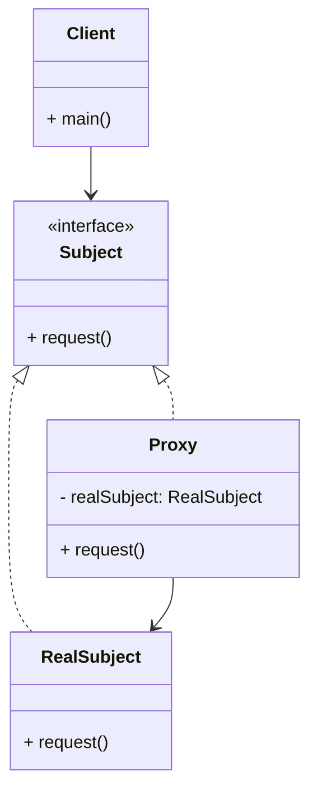

# Article 3-5-1 : Contrôle d'accès avec le pattern Proxy

## Introduction

Le pattern **Proxy** permet de contrôler l'accès à un objet en interposant un substitut qui gère cet accès. Cette technique est particulièrement utile pour implémenter des fonctionnalités comme la sécurité, la gestion de la charge ou le contrôle d'accès, tout en masquant la complexité au client.

---

## Principe du pattern Proxy pour le contrôle d'accès

Le Proxy agit comme un **gardien** : il implémente la même interface que l'objet réel (le _subject_) mais intercepte les appels pour vérifier les permissions ou conditions d'accès avant de déléguer au vrai objet.

### Rôles principaux :

- **Subject** : interface commune au Proxy et à l’objet réel.  
- **RealSubject** : l’objet réel qui exécute les opérations.  
- **Proxy** : l’objet intermédiaire qui contrôle l’accès et peut ajouter des comportements supplémentaires.

---

## Exemple : Contrôle d'accès à un service bancaire

On souhaite que seules certaines opérations soient autorisées selon le rôle de l’utilisateur.

```java
// Interface commune
interface BankService {
    void withdraw(String userRole, double amount);
}

// Objet réel
class RealBankService implements BankService {
    private double balance = 1000;

    @Override
    public void withdraw(String userRole, double amount) {
        if(amount <= balance) {
            balance -= amount;
            System.out.println("Retrait de " + amount + " effectué. Solde restant : " + balance);
        } else {
            System.out.println("Fonds insuffisants.");
        }
    }
}

// Proxy de contrôle d'accès
class BankServiceProxy implements BankService {
    private RealBankService realService = new RealBankService();

    @Override
    public void withdraw(String userRole, double amount) {
        if(userRole.equalsIgnoreCase("admin") || userRole.equalsIgnoreCase("user")) {
            realService.withdraw(userRole, amount);
        } else {
            System.out.println("Accès refusé: rôle utilisateur non autorisé.");
        }
    }
}

// Utilisation
public class Client {
    public static void main(String[] args) {
        BankService bankService = new BankServiceProxy();

        System.out.println("Tentative par admin :");
        bankService.withdraw("admin", 200);

        System.out.println("Tentative par invité :");
        bankService.withdraw("guest", 200);
    }
}
```

**Sortie attendue :**

```
Tentative par admin :
Retrait de 200.0 effectué. Solde restant : 800.0
Tentative par invité :
Accès refusé: rôle utilisateur non autorisé.
```

---

## Diagramme Mermaid du pattern Proxy



---

## Avantages du pattern Proxy dans le contrôle d'accès

- **Séparation des préoccupations** : gestion de la sécurité dans le proxy.  
- **Centralisation** des contrôles d’accès sans modification de l’objet réel.  
- **Flexibilité** pour adapter la logique d’accès sans toucher aux clients.  
- Peut être combiné avec d’autres responsabilités (logging, cache, lazy loading).

---

## Usages courants

- Contrôle d’accès et authentification.  
- Proxy distant (Remote Proxy) pour accès réseau sécurisé.  
- Proxy virtuel pour chargement différé d’objets lourds.  
- Proxy protection dans les architectures distribuées.

---

## Sources utilisées

- Refactoring Guru, "Proxy design pattern", https://refactoring.guru/design-patterns/proxy  
- Baeldung, "Proxy Pattern in Java", https://www.baeldung.com/java-proxy-pattern  
- Gamma et al., "Design Patterns: Elements of Reusable Object-Oriented Software", Addison-Wesley, 1994.

---

Le pattern Proxy constitue une solution souple et puissante pour contrôler l’accès à des ressources sensibles, en intégrant une couche intermédiaire qui protège et régule l’utilisation des objets réels.