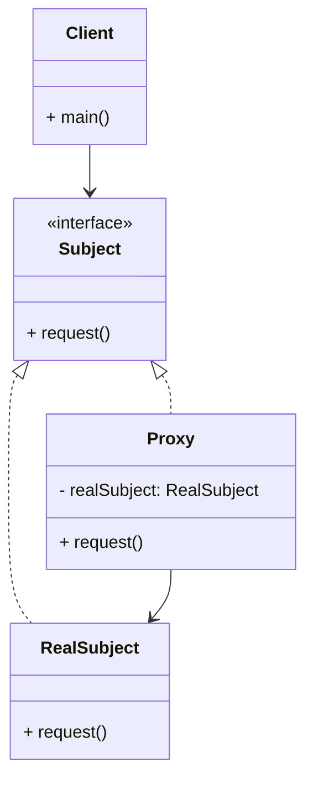

# Article 3-5-2 : Lazy loading avec le pattern Proxy

## Introduction

Le **lazy loading** est une technique d’optimisation des performances qui consiste à retarder l'initialisation d’un objet coûteux jusqu’au moment où il est effectivement nécessaire. Le pattern **Proxy**, notamment le proxy virtuel, est une implémentation élégante de cette stratégie : il intercepte les appels à l’objet réel et crée l’instance lourde uniquement à la demande.

---

## Principe du lazy loading via Proxy

- Le **proxy virtuel** se présente comme un substitut à l’objet réel.  
- Il contient une référence null ou non initialisée vers l’objet réel coûteux.  
- Lorsqu’une méthode est invoquée, il crée l’objet réel si nécessaire, puis délègue l’appel.  
- Cela permet d’optimiser la consommation mémoire et le temps de démarrage.

---

## Exemple en Java : lecture d’une image lourde

Imaginons une application qui doit afficher des images, mais le chargement est coûteux en ressources.

```java
// Interface commune
interface Image {
    void display();
}

// Objet réel lourd
class RealImage implements Image {
    private String filename;

    public RealImage(String filename) {
        this.filename = filename;
        loadFromDisk();
    }

    private void loadFromDisk() {
        System.out.println("Chargement de l'image depuis le disque : " + filename);
    }

    @Override
    public void display() {
        System.out.println("Affichage de l'image : " + filename);
    }
}

// Proxy virtuel implémentant le lazy loading
class ProxyImage implements Image {
    private RealImage realImage;
    private String filename;

    public ProxyImage(String filename) {
        this.filename = filename;
    }

    @Override
    public void display() {
        if (realImage == null) {
            realImage = new RealImage(filename);  // Chargement différé
        }
        realImage.display();
    }
}

// Utilisation
public class Client {
    public static void main(String[] args) {
        Image image = new ProxyImage("photo.jpg");
        System.out.println("Image créée mais non chargée.");
        image.display();  // Chargement effectif ici
        image.display();  // Utilisation sans rechargement
    }
}
```

**Sortie attendue :**

```
Image créée mais non chargée.
Chargement de l'image depuis le disque : photo.jpg
Affichage de l'image : photo.jpg
Affichage de l'image : photo.jpg
```

---

## Diagramme Mermaid du Proxy virtuel pour lazy loading



---

## Avantages du lazy loading avec Proxy

- **Amélioration des performances** en retardant les opérations coûteuses.  
- **Réduction de la consommation mémoire** en évitant de charger tous les objets au démarrage.  
- **Transparence pour le client** qui utilise la même interface que l’objet réel.  
- **Gestion simplifiée** d’objets volumineux, réseaux ou sources lentes.

---

## Cas d’usage fréquents

- Chargement d’images, documents ou vidéos volumineux.  
- Accès différé à des bases de données ou fichiers distants.  
- Instanciation d’objets lourds dont l’utilisation n’est pas systématique.

---

## Sources utilisées

- Refactoring Guru, "Proxy design pattern", https://refactoring.guru/design-patterns/proxy  
- Baeldung, "Proxy Pattern in Java", https://www.baeldung.com/java-proxy-pattern  
- Gamma et al., "Design Patterns: Elements of Reusable Object-Oriented Software", Addison-Wesley, 1994.

---

Le pattern Proxy, par son proxy virtuel, permet une mise en œuvre simple et efficace du lazy loading, optimisant ainsi l’utilisation des ressources en adaptant le moment de création des objets lourds selon les besoins réels de l’application.