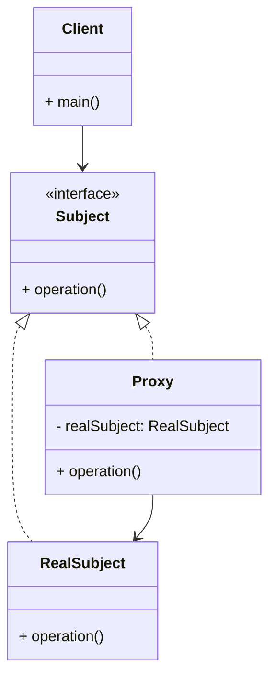

# Article 3-5-3 : Logging transversal avec le pattern Proxy

## Introduction

Le **pattern Proxy** peut être utilisé pour interposer une couche entre le client et l'objet réel, permettant d’ajouter des fonctionnalités transversales sans modifier le code métier. L’une des applications courantes est le **logging transversal** : tracer les appels de méthode, leur durée d’exécution ou d'autres informations, indépendamment de la logique principale.

---

## Principe du logging transversal via Proxy

Le proxy agit comme un **aspect** autour de l’objet réel en :

- Interceptant les appels de méthodes.  
- Effectuant un enregistrement des informations souhaitées (temps, paramètres, erreurs).  
- Déléguant ensuite l’appel à l’objet cible.  

Cette approche respecte le principe de séparation des préoccupations en isolant le code de logging.

---

## Exemple en Java : Proxy simple pour logging

```java
import java.util.Arrays;

// Interface commune
interface Service {
    void process(String request);
}

// Objet réel
class RealService implements Service {
    @Override
    public void process(String request) {
        System.out.println("Traitement de : " + request);
    }
}

// Proxy de logging
class LoggingProxy implements Service {
    private Service realService;

    public LoggingProxy(Service realService) {
        this.realService = realService;
    }

    @Override
    public void process(String request) {
        System.out.println("[LOG] Appel de process avec paramètres : " + request);
        long start = System.currentTimeMillis();

        realService.process(request);

        long end = System.currentTimeMillis();
        System.out.println("[LOG] Durée d'exécution : " + (end - start) + " ms");
    }
}

// Utilisation
public class Client {
    public static void main(String[] args) {
        Service service = new LoggingProxy(new RealService());
        service.process("exemple de requête");
    }
}
```

**Exemple de sortie** :

```
[LOG] Appel de process avec paramètres : exemple de requête
Traitement de : exemple de requête
[LOG] Durée d'exécution : 10 ms
```

---

## Diagramme Mermaid du pattern Proxy avec logging transversal



---

## Avantages du pattern Proxy pour le logging

- **Non-intrusif** : pas besoin de modifier l’objet réel.  
- **Réutilisable** : le proxy de logging peut être appliqué à plusieurs services.  
- **Extensible** : les fonctionnalités de logging peuvent évoluer indépendamment.  
- **Simplifie la maintenance** : centralisation du code de logging.

---

## Cas d’usage typiques

- Traçabilité dans les architectures distribuées.  
- Debugging et surveillance en production.  
- Mesure des performances (profiling).  
- Audits de sécurité.

---

## Sources utilisées

- Refactoring Guru, "Proxy pattern", https://refactoring.guru/design-patterns/proxy  
- Baeldung, "Proxy Pattern in Java", https://www.baeldung.com/java-proxy-pattern  
- Gamma et al., *Design Patterns: Elements of Reusable Object-Oriented Software*, Addison-Wesley, 1994.

---

Le pattern Proxy permet d’introduire facilement un logging transversal, ajoutant une couche de traçabilité à n’importe quel service tout en conservant un code propre et respectueux du principe de séparation des responsabilités.