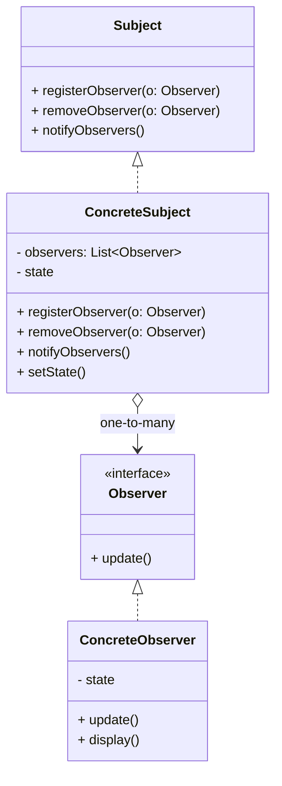

# Article 4-1-1 : Gestion des événements avec le pattern Observer et Event Bus

## Introduction

La communication entre composants logiciels peut s’appuyer sur un mécanisme fondé sur les événements, où certains objets émettent des **notifications** que d’autres objets reçoivent et traitent. Le **pattern Observer** et son extension moderne, l'**Event Bus**, facilitent la gestion décentralisée et asynchrone de ces événements.

---

## Le pattern Observer : principes clés

Le pattern Observer définit une relation **un-à-plusieurs** entre objets :

- Un **sujet (Subject)** maintient une liste d'**observateurs (Observers)**.  
- Lorsqu’un événement ou un changement d'état survient, le sujet notifie tous les observateurs.  
- Les observateurs réagissent selon leur propre logique, sans former un couplage fort avec le sujet.

Cette architecture découple l’émetteur d’événements des récepteurs.

---

## Exemple classique en Java : sujet météo et observers pour température

### Interfaces Observer et Subject

```java
interface Observer {
    void update(float temperature);
}

interface Subject {
    void registerObserver(Observer o);
    void removeObserver(Observer o);
    void notifyObservers();
}
```

### Sujet concret

```java
import java.util.ArrayList;
import java.util.List;

class WeatherData implements Subject {
    private List<Observer> observers = new ArrayList<>();
    private float temperature;

    @Override
    public void registerObserver(Observer o) {
        observers.add(o);
    }

    @Override
    public void removeObserver(Observer o) {
        observers.remove(o);
    }

    @Override
    public void notifyObservers() {
        for (Observer o : observers) {
            o.update(temperature);
        }
    }

    public void setTemperature(float temperature) {
        this.temperature = temperature;
        notifyObservers();
    }
}
```

### Observateurs concrets

```java
class CurrentConditionsDisplay implements Observer {
    private float temperature;

    @Override
    public void update(float temperature) {
        this.temperature = temperature;
        display();
    }

    public void display() {
        System.out.println("Température actuelle : " + temperature + "°C");
    }
}
```

### Utilisation

```java
public class Client {
    public static void main(String[] args) {
        WeatherData weatherData = new WeatherData();

        CurrentConditionsDisplay display = new CurrentConditionsDisplay();
        weatherData.registerObserver(display);

        weatherData.setTemperature(25.3f);
        weatherData.setTemperature(27.8f);
    }
}
```

**Sortie :**

```
Température actuelle : 25.3°C
Température actuelle : 27.8°C
```

---

## Extension moderne : Event Bus

Un **Event Bus** est un système centralisé de publication/abonnement d’événements, souvent utilisé dans des architectures plus complexes ou distribuées. Contrairement à Observer où le sujet connaît directement ses observateurs, l’Event Bus :

- Découple complètement émetteurs et récepteurs.  
- Permet la gestion d’événements diversifiés et asynchrones.  
- Facilite la scalabilité par un mécanisme basé sur des topics (sujets).

Exemples de frameworks : Google Guava EventBus, Vert.x Event Bus.

---

## Diagramme Mermaid du pattern Observer



---

## Avantages de ces approches

- **Découplage fort** entre émetteurs et récepteurs.  
- **Extensibilité** facile avec ajout/suppression dynamique d’observateurs.  
- **Flexibilité** pour répondre à des événements variés.  
- **Adaptation aux architectures événementielles** modernes (microservices, UI, IoT).

---

## Sources utilisées

- Refactoring Guru, "Observer pattern", https://refactoring.guru/design-patterns/observer  
- Baeldung, "Observer pattern in Java", https://www.baeldung.com/java-observer-pattern  
- Google Guava EventBus documentation, https://github.com/google/guava/wiki/EventBusExplained  
- Gamma et al., *Design Patterns: Elements of Reusable Object-Oriented Software*, Addison-Wesley, 1994.

---

Le pattern Observer et le concept d'Event Bus permettent de concevoir des systèmes réactifs et modulaires où la gestion fine des événements et des notifications est déléguée à des mécanismes standardisés, simples à mettre en œuvre et à maintenir.