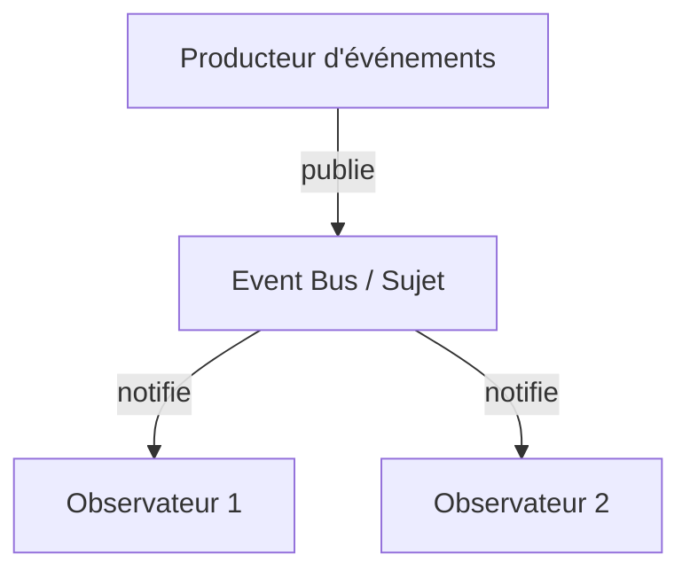

# Article 4-1-2 : Réactivité des applications avec le pattern Observer et Event Bus

## Introduction

La réactivité des applications consiste à concevoir des systèmes capables de réagir rapidement et efficacement aux événements et changements d’état. Les patterns **Observer** et **Event Bus** facilitent l’implémentation de cette réactivité en permettant une communication asynchrone, découplée et scalable entre composants.

---

## Concepts clés de la réactivité

- **Réactivité** signifie répondre rapidement aux entrées, changements ou erreurs.  
- Implique la gestion d’événements, flux de données et notifications en temps réel.  
- Favorise une architecture découplée basée sur la propagation d’événements.

---

## Observer et réactivité

Le pattern **Observer** repose sur un **modèle pub-sub local** permettant au sujet de notifier plusieurs observateurs. Cela assure :

- Mise à jour automatique et immédiate des états dépendants.  
- Propagation simple d’événements au sein d’une application.  
- Base pour construire des interfaces utilisateur réactives.

---

## Event Bus et applications réactives

L’**Event Bus** étend l’Observer à un système centralisé ou distribué avec :

- Multiples producteurs et consommateurs d’événements indépendants.  
- Asynchronisme natif (souvent via des files d'attente ou des brokers).  
- Gestion sophistiquée des événements (filtrage, priorisation).

---

## Exemple en Java avec l’API Reactor (projet Spring)

L’API Reactor est une bibliothèque pour la programmation réactive basée sur les flux de données.

```java
import reactor.core.publisher.Flux;

public class ReactiveExample {
    public static void main(String[] args) {
        Flux<String> eventBus = Flux.just("evenement1", "evenement2", "evenement3");
        
        eventBus.subscribe(event -> {
            System.out.println("Réception et traitement de : " + event);
        });

        // Flux terminera automatiquement car il est fini ici
    }
}
```

Sortie produite :

```
Réception et traitement de : evenement1
Réception et traitement de : evenement2
Réception et traitement de : evenement3
```

---

## Diagramme Mermaid d’un modèle réactif avec Observer / Event Bus



---

## Bénéfices pratiques

- **Amélioration de la réactivité utilisateur** : interfaces mises à jour en temps réel.  
- **Meilleure scalabilité** : traitement événementiel distribué et asynchrone.  
- **Couplage faible** entre composants facilitant maintenance et évolution.  
- **Support facile du traitement d’erreur et backpressure** dans les flux complexes.

---

## Cas d’usage

- Interfaces utilisateur dynamiques (ex: frameworks React, Angular avec RxJS).  
- Microservices basés sur des événements avec Kafka, RabbitMQ.  
- Applications IoT et systèmes temps réel.

---

## Sources utilisées

- Project Reactor documentation, https://projectreactor.io/docs/core/release/reference/  
- Refactoring Guru, "Observer Pattern", https://refactoring.guru/design-patterns/observer  
- Baeldung, "Introduction to Reactive Programming with Reactor", https://www.baeldung.com/reactor-core  
- Gamma et al., *Design Patterns: Elements of Reusable Object-Oriented Software*, Addison-Wesley, 1994.

---

Le pattern Observer et le modèle Event Bus forment les fondations pour construire des applications réactives en facilitant la gestion fluide des événements et en assurant une communication efficace et scalable entre composants logiciels.