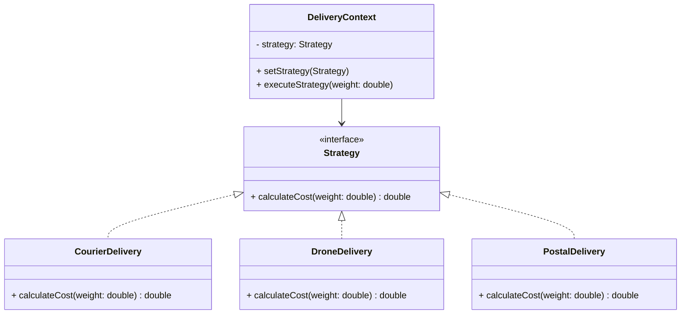

# Article 4-2-1 : Encapsulation d'algorithmes interchangeables avec le pattern Strategy

## Introduction

Le pattern **Strategy** permet de définir une famille d'algorithmes, de les encapsuler chacun dans une classe dédiée, et de rendre ces algorithmes interchangeables au sein d’un contexte. L’objectif principal est d’isoler le comportement variable (l’algorithme) du code client, facilitant ainsi l’extensibilité et la maintenance.

---

## Principe du pattern Strategy

- **Algorithmes encapsulés en objets dédiés** respectant une interface commune.  
- Le **contexte** détient une référence à une stratégie et délègue la tâche à cette stratégie.  
- Permet de changer l’algorithme à l’exécution sans modifier le contexte.  
- Évite les blocs conditionnels imbriqués (if/else ou switch) pour choisir l’algorithme.

---

## Exemple : Calcul du coût de livraison avec stratégies différentes

### Interface Strategy

```java
interface DeliveryStrategy {
    double calculateCost(double weight);
}
```

### Implémentations concrètes

```java
class CourierDelivery implements DeliveryStrategy {
    @Override
    public double calculateCost(double weight) {
        return weight * 5.0;  // Tarif fixe par kilo
    }
}

class DroneDelivery implements DeliveryStrategy {
    @Override
    public double calculateCost(double weight) {
        return weight * 8.0 + 10; // Tarif plus élevé + frais fixe
    }
}

class PostalDelivery implements DeliveryStrategy {
    @Override
    public double calculateCost(double weight) {
        return weight * 3.0 + 2; // Moins cher mais minimum 2€
    }
}
```

### Contexte

```java
class DeliveryContext {
    private DeliveryStrategy strategy;

    public DeliveryContext(DeliveryStrategy strategy) {
        this.strategy = strategy;
    }

    public void setStrategy(DeliveryStrategy strategy) {
        this.strategy = strategy;
    }

    public void executeStrategy(double weight) {
        double cost = strategy.calculateCost(weight);
        System.out.println("Coût de livraison : " + cost + " €");
    }
}
```

### Utilisation

```java
public class Client {
    public static void main(String[] args) {
        DeliveryContext context = new DeliveryContext(new CourierDelivery());
        context.executeStrategy(10);  // Coût selon Courier

        context.setStrategy(new DroneDelivery());
        context.executeStrategy(10);  // Coût selon Drone

        context.setStrategy(new PostalDelivery());
        context.executeStrategy(10);  // Coût selon Poste
    }
}
```

**Sortie attendue :**

```
Coût de livraison : 50.0 €
Coût de livraison : 90.0 €
Coût de livraison : 32.0 €
```

---

## Diagramme Mermaid du pattern Strategy



---

## Avantages du pattern Strategy

- **Séparation claire** entre l’algorithme et son utilisation.  
- **Extensibilité facilitée** : ajout simple de nouvelles stratégies sans modifier le contexte.  
- **Remplacement dynamique** de l’algorithme au moment de l’exécution.  
- **Réduction de la complexité** dans les classes clientes.

---

## Cas d’usage typiques

- Choix dynamique d’algorithmes de tri, compression, cryptage.  
- Gestion flexible des règles de tarifs, promotions ou calculs.  
- Plugins ou modules extensibles dans des applications.

---

## Sources utilisées

- Refactoring Guru, "Strategy design pattern", https://refactoring.guru/design-patterns/strategy  
- Baeldung, "Strategy Pattern in Java", https://www.baeldung.com/java-strategy-pattern  
- Gamma et al., *Design Patterns: Elements of Reusable Object-Oriented Software*, Addison-Wesley, 1994.

---

Le pattern Strategy s’impose dès que plusieurs variantes de comportement doivent coexister et évoluer indépendamment. Il améliore la lisibilité et la modularité du code tout en offrant une forte flexibilité d’utilisation.