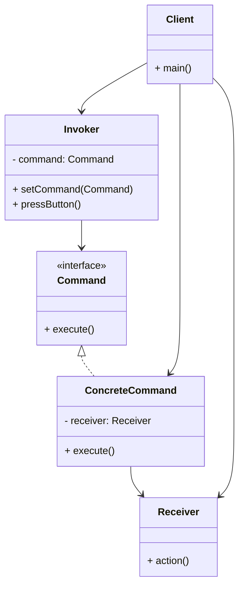

# Article 4-3-1 : Encapsulation des actions avec le pattern Command

## Introduction

Le pattern **Command** permet d'encapsuler une requête ou une action sous forme d’un objet, séparant ainsi l’émetteur de la demande de son exécution réelle. Cette abstraction simplifie les cas où les commandes doivent être stockées, transmises, annulées ou ré-exécutées, tout en offrant une grande flexibilité dans la manipulation des actions.

---

## Principe du pattern Command

- Une **commande** encapsule une action à effectuer et ses paramètres.  
- Elle expose une méthode d’exécution (`execute`).  
- Le **client** crée une commande et la remet à un **invoker** chargé de l’exécuter.  
- Le **receveur** (receiver) est l’objet effectuant l’action concrète.  

Ce découplage facilite notamment la gestion des files d’attente, undo/redo, et l’implémentation de macros.

---

## Exemple Java simple : contrôle d’un système d’éclairage

### Interface Command

```java
public interface Command {
    void execute();
}
```

### Receveur (Light)

```java
public class Light {
    public void on() {
        System.out.println("Lumière allumée");
    }
    public void off() {
        System.out.println("Lumière éteinte");
    }
}
```

### Commandes concrètes

```java
public class LightOnCommand implements Command {
    private Light light;

    public LightOnCommand(Light light) {
        this.light = light;
    }

    @Override
    public void execute() {
        light.on();
    }
}

public class LightOffCommand implements Command {
    private Light light;

    public LightOffCommand(Light light) {
        this.light = light;
    }

    @Override
    public void execute() {
        light.off();
    }
}
```

### Invoker (Télécommande simplifiée)

```java
public class RemoteControl {
    private Command slot;

    public void setCommand(Command command) {
        this.slot = command;
    }

    public void pressButton() {
        if (slot != null) {
            slot.execute();
        }
    }
}
```

### Utilisation

```java
public class Client {
    public static void main(String[] args) {
        Light livingRoomLight = new Light();
        Command lightsOn = new LightOnCommand(livingRoomLight);
        Command lightsOff = new LightOffCommand(livingRoomLight);

        RemoteControl remote = new RemoteControl();

        remote.setCommand(lightsOn);
        remote.pressButton();

        remote.setCommand(lightsOff);
        remote.pressButton();
    }
}
```

**Sortie :**

```
Lumière allumée
Lumière éteinte
```

---

## Diagramme Mermaid du pattern Command



---

## Avantages du pattern Command

- **Découplage** clair entre l’émetteur et l’exécution de l’action.  
- **Gestion simplifiée** de la file d’attente, undo/redo et macros.  
- **Extensibilité** facile par ajout de nouvelles commandes sans modifier le code existant.  
- **Possibilité d’enregistrer des commandes** pour exécution ultérieure ou distante.

---

## Domaines d’application

- Interfaces graphiques avec actions undo/redo.  
- Scripts et macros dans les applications.  
- Traitement différé ou distribué des opérations.  
- Implémentations de transactions.

---

## Sources utilisées

- Refactoring Guru, "Command Pattern", https://refactoring.guru/design-patterns/command  
- Baeldung, "Command Pattern in Java", https://www.baeldung.com/java-command-pattern  
- Gamma et al., *Design Patterns: Elements of Reusable Object-Oriented Software*, Addison-Wesley, 1994.

---

Le pattern Command structure la manipulation des actions sous forme d’objets autonomes, offrant ainsi toute la souplesse nécessaire pour gérer leur exécution, report, annulation ou composition, tout en gardant un code propre et maintenable.