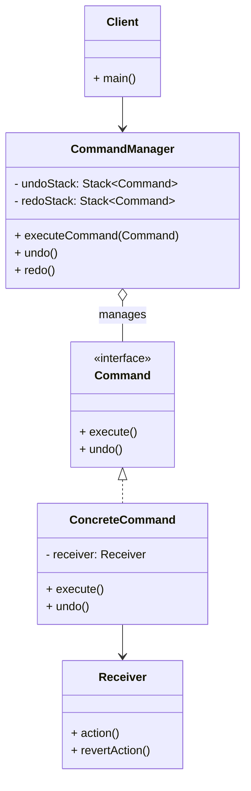

# Article 4-3-2 : Gestion des undo/redo avec le pattern Command

## Introduction

Le pattern **Command** est particulièrement efficace pour implémenter les fonctionnalités **undo** (annulation) et **redo** (rétablissement) dans les applications. En encapsulant les actions sous forme d’objets, il devient possible de stocker l’historique des commandes exécutées et ainsi gérer leurs annulations et ré-exécutions sans couplage fort avec la logique métier.

---

## Principes de gestion des undo/redo avec Command

- Chaque commande doit pouvoir **exécuter** (`execute`) et **annuler** (`undo`) son action.  
- Les commandes sont stockées dans une **pile (stack)** des commandes exécutées pour permettre l’undo (pile d’historique).  
- Une pile distincte contient les commandes annulées pour permettre le redo.  
- Lorsque l’utilisateur effectue une nouvelle action, la pile de redo est vidée.

---

## Exemple simple en Java : gestion undo/redo pour modification de texte

### Interface Command étendue

```java
public interface Command {
    void execute();
    void undo();
}
```

### Receveur

```java
public class TextEditor {
    private StringBuilder text = new StringBuilder();

    public void addText(String newText) {
        text.append(newText);
        System.out.println("Texte actuel : " + text);
    }

    public void removeText(int length) {
        int start = text.length() - length;
        if (start >= 0) {
            text.delete(start, text.length());
            System.out.println("Texte après annulation : " + text);
        }
    }
}
```

### Commande concrete

```java
public class AddTextCommand implements Command {
    private TextEditor editor;
    private String textToAdd;

    public AddTextCommand(TextEditor editor, String textToAdd) {
        this.editor = editor;
        this.textToAdd = textToAdd;
    }

    @Override
    public void execute() {
        editor.addText(textToAdd);
    }

    @Override
    public void undo() {
        editor.removeText(textToAdd.length());
    }
}
```

### Gestionnaire de commandes avec undo/redo

```java
import java.util.Stack;

public class CommandManager {
    private Stack<Command> undoStack = new Stack<>();
    private Stack<Command> redoStack = new Stack<>();

    public void executeCommand(Command command) {
        command.execute();
        undoStack.push(command);
        redoStack.clear();
    }

    public void undo() {
        if (!undoStack.isEmpty()) {
            Command cmd = undoStack.pop();
            cmd.undo();
            redoStack.push(cmd);
        }
    }

    public void redo() {
        if (!redoStack.isEmpty()) {
            Command cmd = redoStack.pop();
            cmd.execute();
            undoStack.push(cmd);
        }
    }
}
```

### Utilisation

```java
public class Client {
    public static void main(String[] args) {
        TextEditor editor = new TextEditor();
        CommandManager manager = new CommandManager();

        Command cmd1 = new AddTextCommand(editor, "Bonjour ");
        Command cmd2 = new AddTextCommand(editor, "le monde!");

        manager.executeCommand(cmd1);
        manager.executeCommand(cmd2);

        manager.undo();
        manager.redo();
    }
}
```

**Sortie attendue :**

```
Texte actuel : Bonjour 
Texte actuel : Bonjour le monde!
Texte après annulation : Bonjour 
Texte actuel : Bonjour le monde!
```

---

## Diagramme Mermaid du pattern Command avec gestion undo/redo



---

## Avantages de cette approche

- **Indépendance des commandes** vis-à-vis du contexte client.  
- **Historique des actions** conservé pour permettre undo/redo fiables.  
- **Extensibilité** avec ajout de nouvelles commandes supportant undo.  
- **Centralisation de la logique d’annulation**, simplifiant la maintenance.

---

## Utilisations courantes

- Éditeurs de texte, graphiques ou vidéo.  
- Applications bureautiques avec modifications utilisateurs.  
- Jeux vidéo pour gérer états et actions.  
- Systèmes transactionnels avec support rollback.

---

## Sources utilisées

- Refactoring Guru, "Command pattern", https://refactoring.guru/design-patterns/command  
- Baeldung, "Command Pattern in Java", https://www.baeldung.com/java-command-pattern  
- Microsoft Docs, "Undo-Redo with Command pattern", https://docs.microsoft.com/en-us/previous-versions/msp-n-p/ff650316(v=pandp.10)  
- Gamma et al., *Design Patterns: Elements of Reusable Object-Oriented Software*, Addison-Wesley, 1994.

---

Le pattern Command, enrichi avec des méthodes d’annulation, offre un cadre robuste pour implémenter les fonctions undo/redo, essentielles à de nombreux logiciels interactifs et éditoriaux. Sa modularité garantit un code organisé, testable et évolutif.