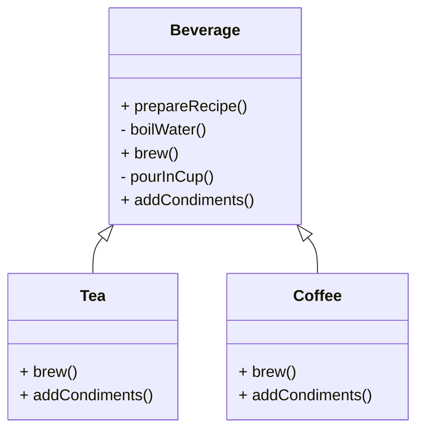

# Article 4-4-1 : Définition du squelette d'un algorithme avec le pattern Template Method

## Introduction

Le pattern **Template Method** permet de définir la structure globale d’un algorithme dans une méthode dite "template" (littéralement "modèle"), tout en laissant certaines étapes spécifiques à être implémentées dans des sous-classes. Ce pattern favorise la réutilisation et la cohérence des processus, tout en offrant la flexibilité nécessaire pour personnaliser certaines parties de l’algorithme.

---

## Principe du pattern Template Method

- Une classe abstraite définit une méthode template qui contient le **squelette** de l’algorithme.  
- Certaines étapes sont implémentées dans la classe abstraite, d’autres sont **abstractes** (méthodes à redéfinir).  
- Les sous-classes fournissent les implémentations spécifiques des étapes abstraites.  
- Permet de **fixer l’ordre d’exécution** tout en adaptant les détails.

---

## Exemple : préparation d’une boisson chaude

### Classe abstraite

```java
public abstract class Beverage {
    // Template method
    public final void prepareRecipe() {
        boilWater();
        brew();
        pourInCup();
        addCondiments();
    }

    private void boilWater() {
        System.out.println("Faire bouillir de l'eau");
    }

    protected abstract void brew();

    private void pourInCup() {
        System.out.println("Verser dans la tasse");
    }

    protected abstract void addCondiments();
}
```

### Sous-classes concrètes

```java
public class Tea extends Beverage {
    @Override
    protected void brew() {
        System.out.println("Infuser le thé");
    }

    @Override
    protected void addCondiments() {
        System.out.println("Ajouter du citron");
    }
}

public class Coffee extends Beverage {
    @Override
    protected void brew() {
        System.out.println("Préparer le café moulu");
    }

    @Override
    protected void addCondiments() {
        System.out.println("Ajouter du sucre et du lait");
    }
}
```

### Utilisation

```java
public class Client {
    public static void main(String[] args) {
        Beverage tea = new Tea();
        Beverage coffee = new Coffee();

        System.out.println("Préparation du thé:");
        tea.prepareRecipe();

        System.out.println("\nPréparation du café:");
        coffee.prepareRecipe();
    }
}
```

**Sortie :**

```
Préparation du thé:
Faire bouillir de l'eau
Infuser le thé
Verser dans la tasse
Ajouter du citron

Préparation du café:
Faire bouillir de l'eau
Préparer le café moulu
Verser dans la tasse
Ajouter du sucre et du lait
```

---

## Diagramme Mermaid du pattern Template Method



---

## Avantages

- **Réutilisation** du code commun par la classe abstraite.  
- **Encapsulation du flux d’algorithme** avec contrôle strict de la séquence.  
- **Flexibilité** via personnalisation des étapes dans les sous-classes.  
- Simplifie la **maintenance** et l’extension des algorithmes.

---

## Domaines d’application

- Frameworks et bibliothèques où un processus standard doit être adapté localement.  
- Traitement de données multi-étapes (validation, transformation, stockage).  
- Interfaces graphiques avec étapes communes et comportements spécifiques.

---

## Sources utilisées

- Refactoring Guru, "Template Method pattern", https://refactoring.guru/design-patterns/template-method  
- Baeldung, "Template Method in Java", https://www.baeldung.com/java-template-method-pattern  
- Gamma et al., *Design Patterns: Elements of Reusable Object-Oriented Software*, Addison-Wesley, 1994.

---

Le pattern Template Method structure les algorithmes en dissociant la **partie commune** et la **partie variable**, ce qui permet de garantir l’ordre d’exécution tout en favorisant l’adaptabilité, la simplicité et la robustesse du code.