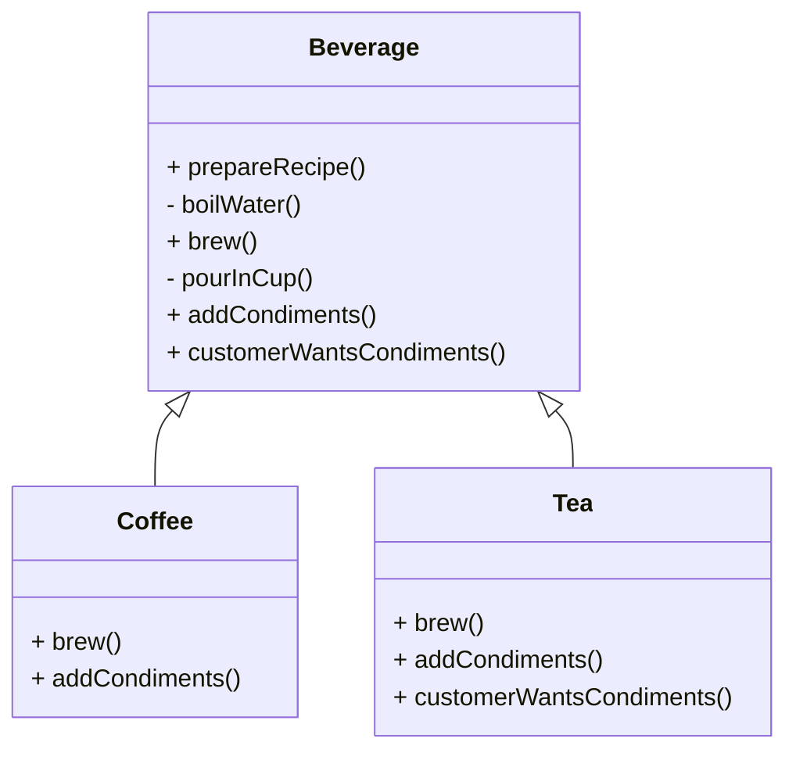

# Article 4-4-2 : Spécialisation des étapes de l'algorithme avec le pattern Template Method

## Introduction

Le pattern **Template Method** définit un algorithme dans une méthode abstraite, laissant la possibilité aux sous-classes de spécialiser certaines étapes de cet algorithme. Cette spécialisation peut être obligatoire via des méthodes abstraites, ou optionnelle par l’usage de méthodes dites "hooks" (accroches), que les sous-classes peuvent ou non redéfinir pour modifier le comportement par défaut.

---

## Mécanismes de spécialisation dans Template Method

1. **Méthodes abstraites**  
   - Obligent les sous-classes à fournir une implémentation des étapes spécifiques.  
   - Garantissent que l’algorithme est complet et fonctionnel.
   
2. **Hooks (accroches)**  
   - Méthodes avec une implémentation par défaut dans la classe abstraite.  
   - Les sous-classes choisissent de les redéfinir pour modifier ou enrichir le comportement.  
   - Par exemple, exécuter une étape supplémentaire ou ignorer une action.

---

## Exemple concret : préparation d'une boisson avec hook optionnel

### Classe abstraite

```java
public abstract class Beverage {
    // Template method
    public final void prepareRecipe() {
        boilWater();
        brew();
        pourInCup();
        if (customerWantsCondiments()) {
            addCondiments();
        }
    }

    private void boilWater() {
        System.out.println("Faire bouillir de l'eau");
    }

    protected abstract void brew();

    private void pourInCup() {
        System.out.println("Verser dans la tasse");
    }

    protected abstract void addCondiments();

    // Hook : choix optionnel
    protected boolean customerWantsCondiments() {
        return true; // par défaut, on ajoute les condiments
    }
}
```

### Sous-classe qui utilise le hook pour modifier le comportement

```java
public class Coffee extends Beverage {
    @Override
    protected void brew() {
        System.out.println("Préparer le café moulu");
    }

    @Override
    protected void addCondiments() {
        System.out.println("Ajouter du sucre et du lait");
    }
}

public class Tea extends Beverage {
    @Override
    protected void brew() {
        System.out.println("Infuser le thé");
    }

    @Override
    protected void addCondiments() {
        System.out.println("Ajouter du citron");
    }

    @Override
    protected boolean customerWantsCondiments() {
        // Simulation d'un choix utilisateur
        return false; // Le client ne veut pas de condiments
    }
}
```

### Test d’utilisation

```java
public class Client {
    public static void main(String[] args) {
        Beverage coffee = new Coffee();
        Beverage tea = new Tea();

        System.out.println("Préparation du café:");
        coffee.prepareRecipe();

        System.out.println("\nPréparation du thé:");
        tea.prepareRecipe();
    }
}
```

**Sortie attendue :**

```
Préparation du café:
Faire bouillir de l'eau
Préparer le café moulu
Verser dans la tasse
Ajouter du sucre et du lait

Préparation du thé:
Faire bouillir de l'eau
Infuser le thé
Verser dans la tasse
```

Le thé est servi sans condiments grâce à la redéfinition du hook.

---

## Diagramme Mermaid mettant en évidence la spécialisation avec hooks



---

## Points clés

- **Méthodes abstraites** pour étapes obligatoires et variables.  
- **Hooks** pour offrir une personnalisation optionnelle, sans forcer les sous-classes à redéfinir toutes les méthodes.  
- Structure claire garantissant la cohérence tout en laissant place à la flexibilité.  
- Facilite l’évolution et l’adaptation d’algorithmes complexes.

---

## Sources utilisées

- Refactoring Guru, "Template Method pattern", https://refactoring.guru/design-patterns/template-method  
- Baeldung, "Template Method in Java", https://www.baeldung.com/java-template-method-pattern  
- Gamma et al., *Design Patterns: Elements of Reusable Object-Oriented Software*, Addison-Wesley, 1994.

---

La spécialisation des étapes dans le pattern Template Method, combinant méthodes abstraites obligatoires et hooks optionnels, permet d’adapter finement un algorithme défini tout en assurant la robustesse et la maintenabilité du code.