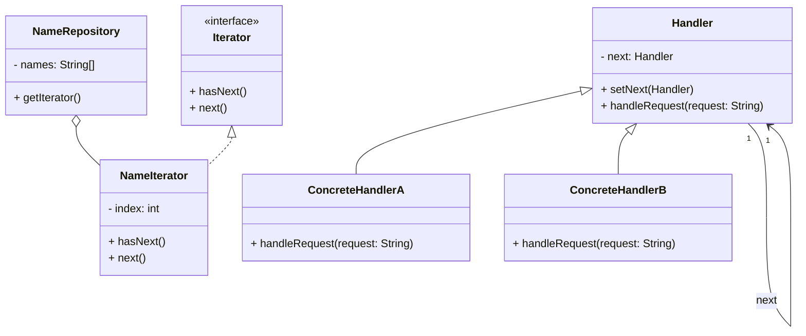

# Article 4-5-1 : Parcours d'éléments avec les patterns Iterator et Chain of Responsibility

## Introduction

Le **parcours d’éléments** dans une collection ou une chaîne de responsabilités est un besoin fréquent en programmation, qui peut facilement devenir complexe lorsque la structure interne des objets ou le chemin de traitement varient. Les design patterns **Iterator** et **Chain of Responsibility** apportent une solution élégante et flexible à ces problématiques en séparant les mécanismes de parcours et de traitement.

---

## Le pattern Iterator : itérer sur une collection sans exposer sa structure

### Principe

L'Iterator fournit une façon standard d’accéder séquentiellement aux éléments d’un objet agrégat (collection) sans exposer son implantation interne. Il permet de traiter les collections uniformément, quel que soit leur type (listes, arbres, tables de hachage).

### Interface de base

```java
public interface Iterator<T> {
    boolean hasNext();
    T next();
}
```

### Exemple simple en Java

```java
public class NameRepository {
    private String[] names = {"Alice", "Bob", "Charlie"};

    public Iterator<String> getIterator() {
        return new NameIterator();
    }

    private class NameIterator implements Iterator<String> {
        int index;

        public boolean hasNext() {
            return index < names.length;
        }

        public String next() {
            if(hasNext()) {
                return names[index++];
            }
            return null;
        }
    }
}

// Utilisation
public class Client {
    public static void main(String[] args) {
        NameRepository repo = new NameRepository();
        Iterator<String> iterator = repo.getIterator();
        while(iterator.hasNext()) {
            System.out.println(iterator.next());
        }
    }
}
```

**Sortie :**

```
Alice
Bob
Charlie
```

---

## Le pattern Chain of Responsibility : chaîner les handlers pour traiter une requête

### Principe

Une requête est envoyée à une chaîne d’objets (handlers) où chaque objet décide de la traiter ou de la transmettre au suivant. Cela évite un couplage fort entre l'émetteur et celui qui traite la requête.

### Exemple en Java

```java
abstract class Handler {
    protected Handler next;

    public void setNext(Handler next) {
        this.next = next;
    }

    public abstract void handleRequest(String request);
}

class ConcreteHandlerA extends Handler {
    public void handleRequest(String request) {
        if (request.equals("A")) {
            System.out.println("Handled by A");
        } else if (next != null) {
            next.handleRequest(request);
        }
    }
}

class ConcreteHandlerB extends Handler {
    public void handleRequest(String request) {
        if (request.equals("B")) {
            System.out.println("Handled by B");
        } else if (next != null) {
            next.handleRequest(request);
        }
    }
}

// Utilisation
public class Client {
    public static void main(String[] args) {
        Handler handlerA = new ConcreteHandlerA();
        Handler handlerB = new ConcreteHandlerB();

        handlerA.setNext(handlerB);

        handlerA.handleRequest("B"); // Output: Handled by B
        handlerA.handleRequest("A"); // Output: Handled by A
        handlerA.handleRequest("C"); // Ne sera pas traité
    }
}
```

---

## Diagramme Mermaid combiné



---

## Comparaison et complémentarité

| Aspect                    | Iterator                                             | Chain of Responsibility                     |
|--------------------------|-----------------------------------------------------|---------------------------------------------|
| But                      | Parcourir séquentiellement les éléments d'une collection sans exposer sa structure. | Passer une requête à une chaîne d’objets jusqu'à traitement. |
| Structure                | Itérateur avec méthodes `hasNext` et `next`.          | Chaîne d’objets liés avec `setNext` et `handle`. |
| Utilisation typique       | Parcours homogène des éléments (listes, arbres).       | Décision dynamique sur quel handler traite une requête. |
| Couplage                  | Détache la collection et son parcours.                | Détache l’émetteur de la requête du récepteur concret. |

---

## Applications pratiques

- **Iterator** : Boucles sur collections personnalisées, accès uniforme à différents types de données dans un framework.  
- **Chain of Responsibility** : Traitement des événements dans les interfaces graphiques, gestion des requêtes web, validation successive, logging.

---

## Sources utilisées

- Refactoring Guru, "Iterator Pattern", https://refactoring.guru/design-patterns/iterator  
- Refactoring Guru, "Chain of Responsibility Pattern", https://refactoring.guru/design-patterns/chain-of-responsibility  
- Baeldung, "Java Design Patterns – Iterator and Chain of Responsibility", https://www.baeldung.com/java-iterator-pattern  
- Gamma et al., *Design Patterns: Elements of Reusable Object-Oriented Software*, Addison-Wesley, 1994.

---

Les patterns Iterator et Chain of Responsibility fournissent des solutions complémentaires pour le parcours et le traitement des éléments ou requêtes. Ils améliorent la modularité et la flexibilité des codes qui manipulent des collections d’objets ou des flux de requêtes.