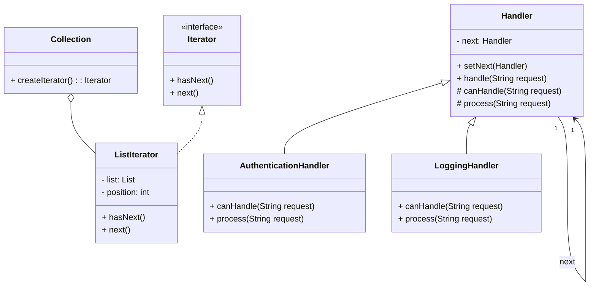

# Article 4-5-2 : Délégation de responsabilité entre objets avec les patterns Iterator et Chain of Responsibility

## Introduction

Les patterns **Iterator** et **Chain of Responsibility** illustrent deux formes de délégation de responsabilité essentielle dans la conception orientée objet. L’un se focalise sur la délégation de parcours d’une collection, l’autre sur la délégation du traitement ou de la gestion d’une requête entre plusieurs objets. Comprendre cette délégation est clé pour concevoir des systèmes souples, extensibles et découplés.

---

## Délégation dans le pattern Iterator

### Concept

Le pattern Iterator externalise le parcours d’une collection à un objet distinct appelé **itérateur**. Au lieu que la collection expose sa structure interne, elle délègue la responsabilité de navigation à cet itérateur, qui fournit des méthodes standardisées pour accéder aux éléments un par un.

### Exemple simplifié

```java
public interface Iterator<T> {
    boolean hasNext();
    T next();
}

public class ListIterator<T> implements Iterator<T> {
    private List<T> list;
    private int position = 0;

    public ListIterator(List<T> list) {
        this.list = list;
    }

    public boolean hasNext() {
        return position < list.size();
    }

    public T next() {
        if (!hasNext()) throw new NoSuchElementException();
        return list.get(position++);
    }
}

public class Client {
    public static void main(String[] args) {
        List<String> names = Arrays.asList("Ana", "Ben", "Cara");
        Iterator<String> iterator = new ListIterator<>(names);

        while (iterator.hasNext()) {
            System.out.println(iterator.next());
        }
    }
}
```

### Avantage clé

La collection **délègue** à l’itérateur la responsabilité du parcours, ce qui permet de modifier la structure interne de la collection sans impacter le client qui consomme l’itérateur.

---

## Délégation dans le pattern Chain of Responsibility

### Concept

Ce pattern organise plusieurs objets en chaîne. Chaque objet **délègue** la responsabilité de traitement à l’objet suivant si celui-ci ne peut pas gérer la requête. La requête circule ainsi jusqu’au handler capable de la traiter.

### Exemple simplifié

```java
abstract class Handler {
    protected Handler next;

    public void setNext(Handler next) {
        this.next = next;
    }

    public void handle(String request) {
        if (canHandle(request)) {
            process(request);
        } else if (next != null) {
            next.handle(request);
        }
    }

    protected abstract boolean canHandle(String request);
    protected abstract void process(String request);
}

class AuthenticationHandler extends Handler {
    protected boolean canHandle(String request) {
        return request.equals("auth");
    }

    protected void process(String request) {
        System.out.println("Authentification traitée");
    }
}

class LoggingHandler extends Handler {
    protected boolean canHandle(String request) {
        return request.equals("log");
    }

    protected void process(String request) {
        System.out.println("Logging effectué");
    }
}

public class Client {
    public static void main(String[] args) {
        Handler auth = new AuthenticationHandler();
        Handler log = new LoggingHandler();
        auth.setNext(log);

        auth.handle("auth"); // Authentification traitée
        auth.handle("log");  // Logging effectué
        auth.handle("other"); // Non traité (aucun handler)
    }
}
```

### Avantage clé

Chaque handler **délègue** la requête à son successeur s’il ne peut pas la gérer, créant une chaîne flexible d’objets pouvant être modifiée dynamiquement.

---

## Diagramme Mermaid illustrant la délégation dans les deux patterns



---

## Synthèse et recommandations

| Pattern                 | Objet délégué                   | Type de responsabilité déléguée              | Flexibilité apportée                                  |
|-------------------------|--------------------------------|-----------------------------------------------|------------------------------------------------------|
| Iterator                | Itérateur                      | Parcours d'éléments                            | Permet l’itération indépendante de la structure d’origine |
| Chain of Responsibility | Handler suivant dans la chaîne | Traitement ou gestion d’une requête            | Permet composition dynamique d’objets pour le traitement |

Pour la gestion de collections, préférez Iterator pour séparer parcours et structure. Pour des traitements chaînés ou multi-étapes, Chain of Responsibility offre une gestion fluide et modulaire.

---

## Sources utilisées

- Refactoring Guru, *Iterator Pattern*, https://refactoring.guru/design-patterns/iterator  
- Refactoring Guru, *Chain of Responsibility Pattern*, https://refactoring.guru/design-patterns/chain-of-responsibility  
- Baeldung, *Chain of Responsibility en Java*, https://www.baeldung.com/java-chain-of-responsibility-pattern  
- Gamma et al., *Design Patterns: Elements of Reusable Object-Oriented Software*, Addison-Wesley, 1994.

---

La délégation constitue un mécanisme fondamental pour gérer proprement responsabilités et comportements dans des systèmes complexes, qui se retrouve clairement illustrée dans les patterns Iterator et Chain of Responsibility, chacun optimisant la flexibilité et la maintenabilité à sa manière.